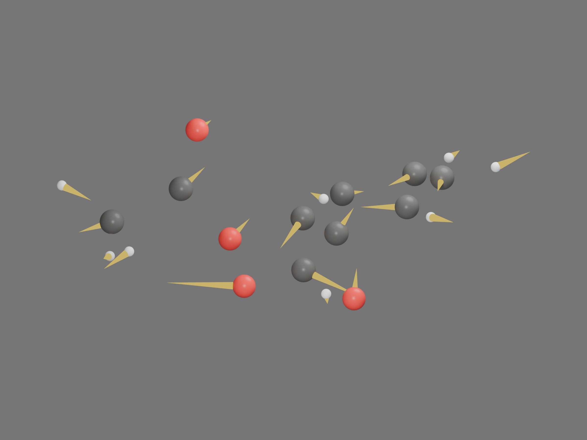
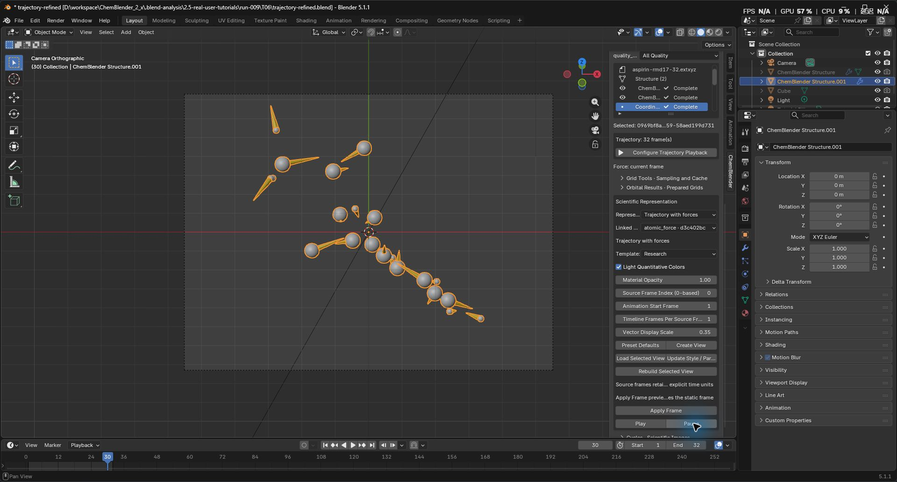
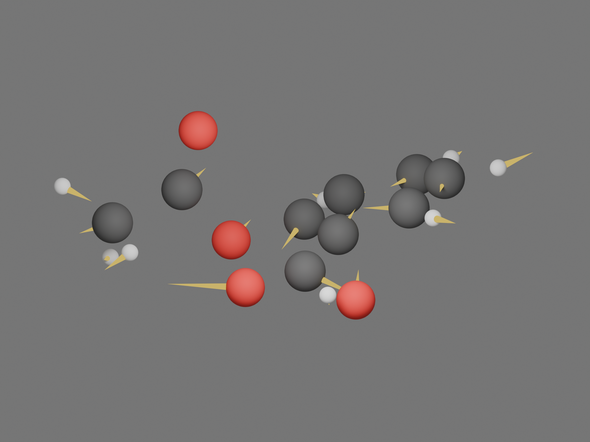
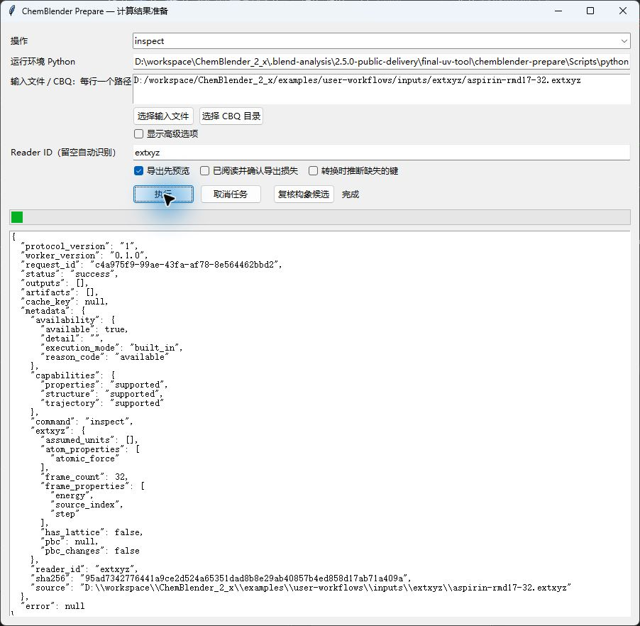
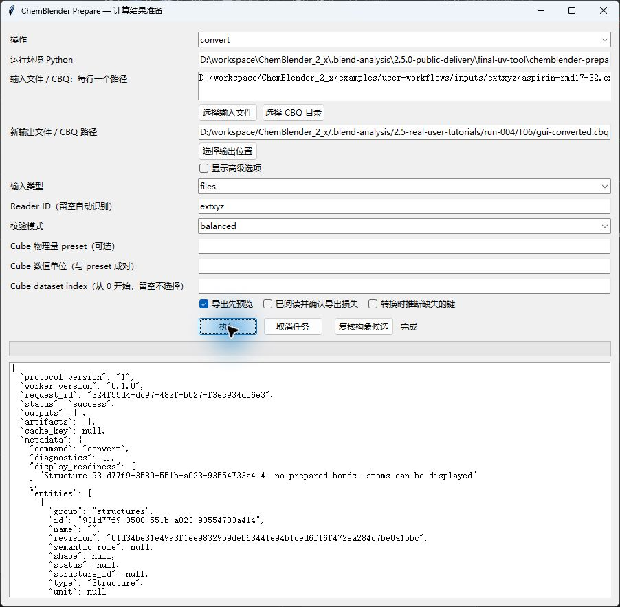
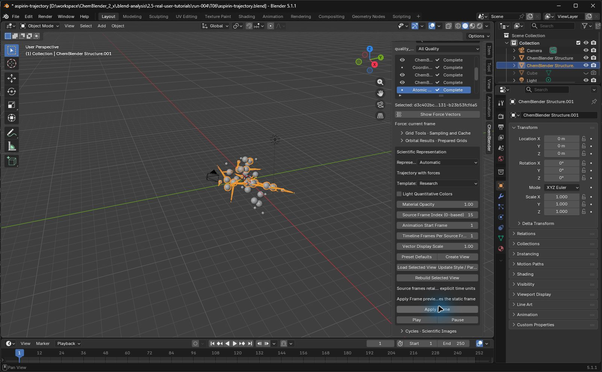
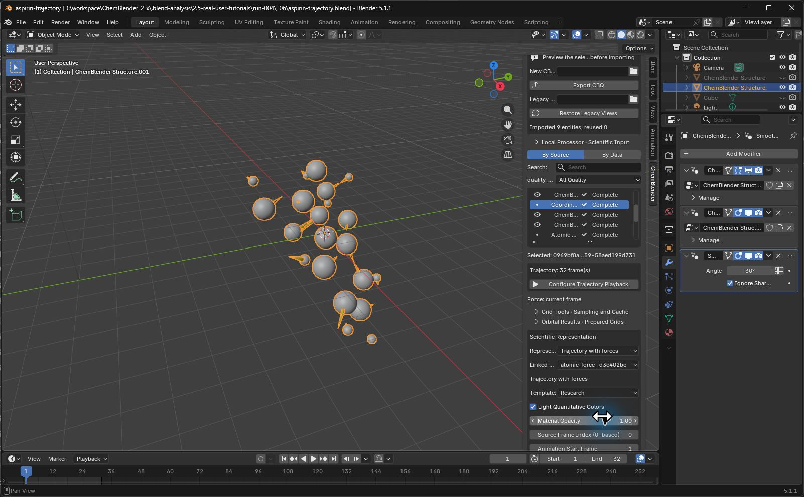
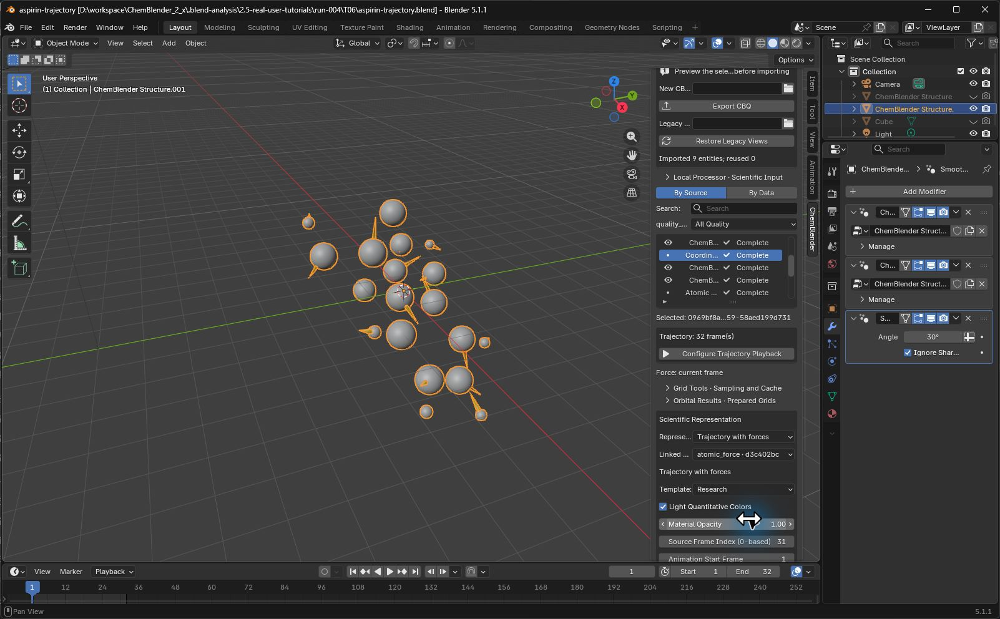
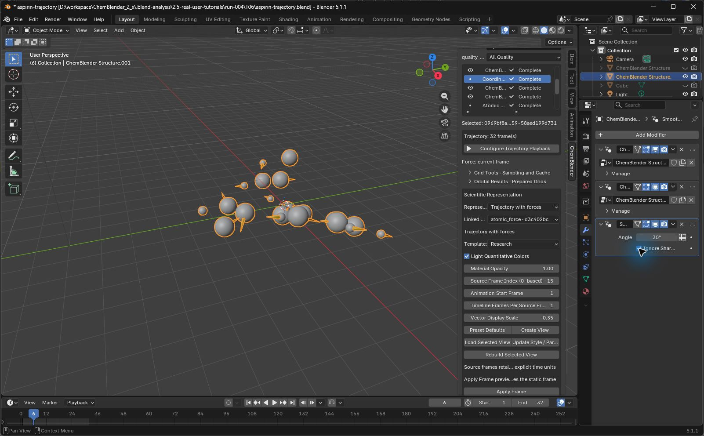

# T06: aspirin trajectory and same-frame forces

## Current candidate: refined project and verified playback

The earlier walkthrough and images below retain their original candidate binding. For the current local review use `trajectory-refined.blend` with its complete same-name `.cbq` directory in `run-009/T06`. Extension SHA-256 is `a1e2da79253d505b60daa42aa465eb725cdd1eba00e6c81ce4082102a62d0f28`; prepare wheel SHA-256 is `b736bc61ecdbee77f61696576c98092afc7352a9af16b4367bfd3c2e3159af3a`. The fixed input and scientific units below are unchanged. New [Prepare GUI checks](../../../examples/tutorials/2.5.0/T06-run009-gui-check.json) and [all-frame View checks](../../../examples/tutorials/2.5.0/T06-run009-view-check.json) bind this candidate. Large artifacts are local review files; a distributable download is still pending.



Atom display scale is `0.3`, vector display scale `0.35`, atom subdivision `5` and material roughness `0.3`. A point light of power `14000` and a disk fill light of power `1800`, size `8`, improve visibility. This project uses a single Set Shade Smooth atom branch with 21,000 smooth faces. It does not use the earlier Smooth by Angle modifier. Custom node editing was performed through MCP; its manual GUI construction remains unverified. Preserve the scientific arrays: these changes improve display surfaces, not data sampling resolution. Some arrows remain occluded in this projection.

1. Open the refined `.blend` beside its `.cbq`. If the restored Image Editor covers the scene, close that secondary window. Select the force View `ChemBlender Structure.001`, then use `Load Selected View` under `Scientific Representation`. Cold loading leaves scientific playback paused.
2. Select the coordinates FrameSet in Project Browser and click `Configure Trajectory Playback`. Scroll within the ChemBlender sidebar to the scientific controls. Retain Animation Start Frame `1` and Timeline Frames Per Source Frame `1`.
3. Click `Play` below `Apply Frame`, then `Pause`. These buttons were clicked through Computer Use on this candidate. The paused capture shows timeline frame `30`, corresponding to source frame `29`; coordinates and scaled forces matched that source frame within `1e-6`.



`Source Frame Index (0-based)` is the static Apply Frame input. It remained `0` during this playback and is not a live frame counter. Use the timeline mapping for playback; a static Apply Frame preview may differ from the timeline. The [GUI playback record](../../../examples/tutorials/2.5.0/T06-run009-playback-gui-check.json) separates MCP setup from actual clicks. Some labels are truncated in the narrow sidebar; full screenshot readability and human replay are pending.

The refined pair passed original and moved-copy cold reopening with source frame 15 and smoothing intact: [refinement and recovery record](../../../examples/tutorials/2.5.0/T06-run009-refined-check.json). The newer 32-frame sequence uses explicit public FRAME and render replay, followed by native VSE assembly. H.264/MPEG4 playback at 2400×1800 and 24 fps reached the end in 1.333333 seconds under browser CDP offline emulation: [animation record](../../../examples/tutorials/2.5.0/T06-run009-animation-check.json). This is not a new Ctrl+F12 GUI validation or an operating-system network-isolation test. The video assembly has absolute frame paths and has not passed relocation. Physical time remains unknown.

The older `trajectory-view.blend` draft contains overlapping flat and smooth display branches; use the refined pair. Rebuild may remove custom appearance nodes, which must be reapplied. New-candidate rebuild, complete manual rendering instructions, portable video assembly and independent human acceptance remain open.

This is a working draft. Input conversion, all-frame scientific comparisons, actual Create View / Apply Frame / Play / Pause operations and a static render have evidence. The 32-frame PNG sequence, H.264 encoding, original/moved cold reopening and derived-geometry rebuilding also passed. Continuous screen recording, remaining GUI coverage and independent human replay are pending.



Gray is carbon, red is oxygen, white is hydrogen and yellow arrows show atomic forces. The input has no prepared bonds, so this view displays atoms and arrows. Some arrows overlap atoms in this projection. Light and shading change the displayed colors; this image is not a quantitative color scale.

## Fixed input and prerequisites

Complete [installation](installation.md) and [the first lesson](first-aspirin.md). Use Blender 5.1.1 and prepare 0.1.0. Candidate Extension SHA-256: `963b905f3e5ee3c5fc1fa53a1ccefd5c60616d89ac77977efe4afdbed066426a`. Download [aspirin-rmd17-32.extxyz](../../../examples/user-workflows/inputs/extxyz/aspirin-rmd17-32.extxyz), its [source and license note](../../../examples/user-workflows/inputs/extxyz/aspirin-rmd17-32.md), and the [frozen specification](../../../examples/tutorials/2.5.0/T06.case-spec.json). The source note contains older Quick Import instructions; use the CBQ route below for 2.5.

| Item | Reference |
| --- | --- |
| Input SHA-256 | `95ad7342776441a9ce2d524a65351dad8b8e29ab40857b4ed858d17ab71a409a` |
| Source | CC0 rMD17 v3 aspirin; NPZ rows 0, 100, …, 3100 |
| Shape | 32 frames × 21 atoms × 3 components |
| Coordinates | angstrom |
| Forces | electron_volt_per_angstrom |
| Energy | electron_volt |
| step | dimensionless array-row identifier |
| source_index | Original index; unit unknown and semantic status ambiguous |
| Physical time interval | Not supplied; label by source frame, never ps |

## Prepare the CBQ

Put the input in a new lesson folder. In Prepare, use the installed Standard runtime Python and follow these recorded steps:

1. Choose `inspect`, paste the extXYZ path into the input field and set Reader ID to `extxyz`. Click `执行` (Execute). Changing operation rearranges the form; locate the button again before clicking. Expect `success`, frame_count `32`, atomic_force and frame properties energy/source_index/step.



2. Choose `convert`, retain the input and Reader ID, set Input Type to `files` and Validation Mode to `balanced`. Enter a new output CBQ path and click `执行`. Expect `success`; the no-prepared-bonds diagnostic is consistent with the atom/arrow View below. The recorded GUI output used `gui-converted.cbq` to preserve the existing project.



The [GUI-output scientific check](../assets/2.5-tutorials/trajectory-gui-science-check.json) compared all 32 frames independently against the input. These equivalent public commands also passed; replace the example paths.

```powershell
chemblender-prepare inspect "D:\ChemBlenderLessons\T06\aspirin-rmd17-32.extxyz" --reader extxyz --json
chemblender-prepare convert "D:\ChemBlenderLessons\T06\aspirin-rmd17-32.extxyz" --reader extxyz -o "D:\ChemBlenderLessons\T06\aspirin-trajectory.cbq" --json
chemblender-prepare validate "D:\ChemBlenderLessons\T06\aspirin-trajectory.cbq" --json
```

Expect success and a FrameSet with `coordinates`, an `atomic_force` AtomFrameProperty, and frame properties `energy`, `step`, `source_index`. All stored coordinates, forces and numeric frame properties matched independently parsed input text exactly. Atom species/order stayed constant across all 32 frames. Preserve the ambiguous source_index status; a successful conversion does not supply missing units.

## Create and inspect the trajectory

1. In a new scene, set `CBQ Package`, confirm the path, then use `Preview CBQ` and `Import CBQ`. The recorded import added nine entities. This import reused verified public Operators through MCP; the following trajectory controls were tested through the actual GUI.
2. Select the FrameSet in Project Browser. Under `Scientific Representation`, retain `Automatic` and `Research`; the description reads `Trajectory frame`. Click `Create View`.
3. Select the `atomic_force` dataset. `Automatic` now resolves to `Trajectory with forces`. Click `Create View` again. This creates a separate View bound to the same FrameSet and its force property.
4. Hide the earlier plain trajectory View in viewport and render, retaining it in the project. Hide the default Cube in both places. Select the force View and frame it with numpad `.`. Overlapping Views at different frames can otherwise look like extra atoms.
5. In the force View controls, set `Source Frame Index (0-based)` to `15`, then click `Apply Frame`. The preview updates coordinates and force arrows together. Check frames `0` and `31` in the same way; the captures below show both endpoints after authorized public FRAME replay.







[Endpoint checks](../assets/2.5-tutorials/trajectory-first-last-check.json) confirm coordinates and scaled forces within display tolerance. These screenshots document the visible result; they do not represent new manual Apply Frame clicks.

The subsequent public `FRAME` replay checked all 32 frames. Display vertices and vectors matched the corresponding source arrays within `1e-6` at display precision, while authoritative arrays remained unchanged. When Vector Display Scale differs from 1, compare displayed vectors against source force multiplied by that scale. The [recorded all-frame check](../assets/2.5-tutorials/trajectory-force-check.json) used scale 1 before cosmetic refinement.

| Source frame | Energy, eV | step | source_index |
| --- | --- | --- | --- |
| 0 | -17617.8287419 | 0 | 161596 |
| 15 | -17617.4879446 | 1500 | 26491 |
| 31 | -17617.7618802 | 3100 | 151469 |

These are dataset references, not energies recomputed by Blender. The table does not imply that the UI displays every field beside the moving structure.

## Play and pause

Scroll within the sidebar until `Play` and `Pause` appear below `Apply Frame`. Keep Animation Start Frame `1` and Timeline Frames Per Source Frame `1`. Click `Play`: the recorded timeline range became 1–32, with source frame equal to timeline frame minus one. Click `Pause` to stop both timeline and scientific playback. Twelve timestamped screenshots were sampled during actual playback; they are not a continuous recording.

`Apply Frame` previews a static source frame. The scene timeline can show another number while paused; use the source-frame control and saved View metadata when identifying that preview. A display rate of 24 fps does not establish the missing physical sampling interval or statistical independence of these selected configurations.

## Refine and render

1. On the selected force View, use `Load Selected View`, set Vector Display Scale to `0.35` and enable `Light Quantitative Colors`, then `Update Style / Parameters`. This smaller arrow scale is a display choice, not a force-unit conversion.
2. In the existing `CH_Ball and Stick` node, set Subdivision to `5`, as in [the ethanol lesson](ethanol-conformers.md). Keep the source coordinates and forces intact.
3. Select the View in Object Mode. With the pointer over the viewport, press F3, search `Smooth by Angle` and confirm. Open Modifiers Properties and enable `Ignore Sharpness` on the new modifier; leave Angle at 30°. This exact GUI sequence resolved the faceted atoms. Without selection the command did not add a modifier; without Ignore Sharpness the existing sharp-edge marks preserved the facets.



4. The recorded camera is orthographic at `(0, -16, 11)`, aimed at the origin, Orthographic Scale `11`. Point Light is at `(0, -8, 9)`, Power `6500`, Radius `3`; World Background linear RGB is `(0.18, 0.18, 0.18)`, Strength `1`. These composition values were set through MCP replay; full manual panel instructions are still pending.
5. Use Cycles, CPU, 256 samples, denoising and output `2400×1800`, 100%, PNG. Render source frame 15 and save the PNG separately. Keep the `.blend` and same-name `.cbq` directory together.
6. For the recorded animation route, retain the scientific playback driver while stopping viewport playback, set the scene range to 1–32 and render into a new PNG directory with `Ctrl+F12`. The actual shortcut was tested. All 32 completed PNGs passed decoding and post-render same-frame checks. A separate Blender VSE assembly encoded them as H.264/MPEG4 at 2400×1800 and 24 fps, with 32 video samples and duration 1.333333 seconds. Actual offline browser playback reached the end. The assembly used native API replay; the complete manual assembly/driver-retention GUI route remains pending.

Rebuild or Update can replace display objects. Reapply custom subdivision and Smooth by Angle after such replacement; inspect the modifier list before rendering. More display polygons or smoother normals do not add new scientific samples.

## Handover and recovery boundaries

The working pair is `aspirin-trajectory.blend` plus the complete `aspirin-trajectory.cbq` directory. Retain the static PNG and future full PNG sequence separately. Original and relocated-copy cold reopening passed, retaining source frame 15, both Views, force scaling and Smooth by Angle with Ignore Sharpness. Scientific playback is disabled after loading; explicitly start it again before playing. On a separate copy, clearing the force View mesh then using the public REBUILD Operator restored the same-frame coordinates and force without changing scientific arrays; another cold reopen passed. Custom Smooth by Angle was absent after rebuilding, so reapply cosmetic refinement. These checks do not establish source/processor-unavailable offline reconstruction. Do not delete authoritative `.npy` arrays as a display-cache repair.

One animation attempt was cancelled while diagnosing a pre-render audit mismatch. A two-frame test showed that `render_pre` runs before source-frame updating; `render_post` matched the right frame, and animation frame 2 matched an explicit same-frame static render pixel-for-pixel. That was an evidence-timing issue, not a demonstrated product wrong-frame defect. Final acceptance must inspect completed frames and post-render checks.

See the [32-frame audit](../assets/2.5-tutorials/trajectory-animation-check.json), [video integrity record](../assets/2.5-tutorials/trajectory-video-check.json), [original/moved cold record](../assets/2.5-tutorials/trajectory-cold-recovery.json) and [display rebuild record](../assets/2.5-tutorials/trajectory-cache-recovery.json). Large frame sequences, MP4 and paired projects remain in the local case artifact directory, outside the Extension ZIP.

Human replay, continuous GUI recording, scalar frame-panel inspection and case packaging remain pending. [Media provenance](../assets/2.5-tutorials/provenance.json) records original captures separately from rendered images.
