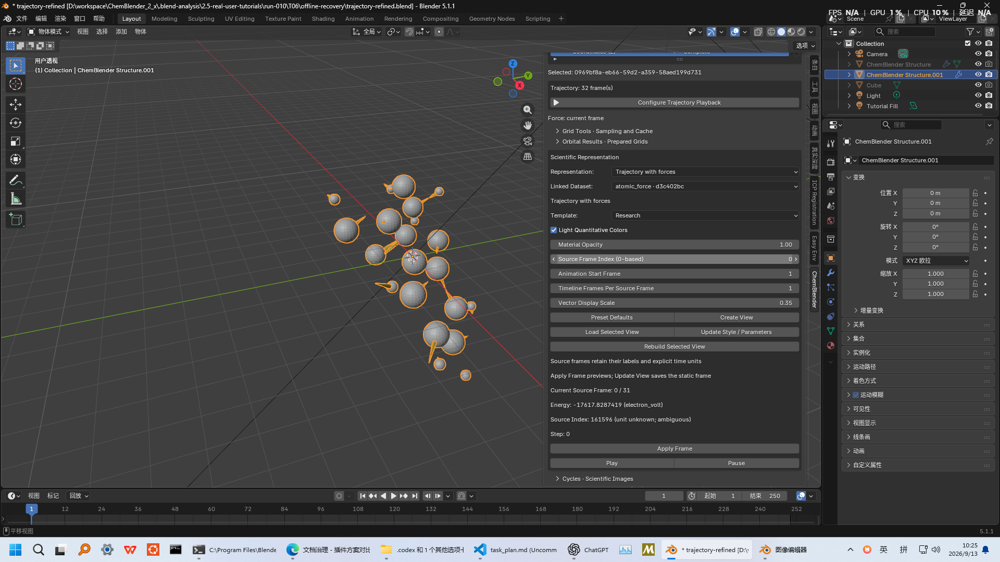
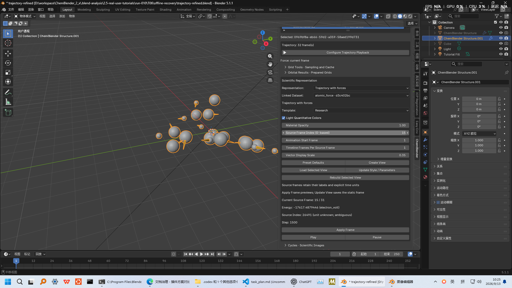
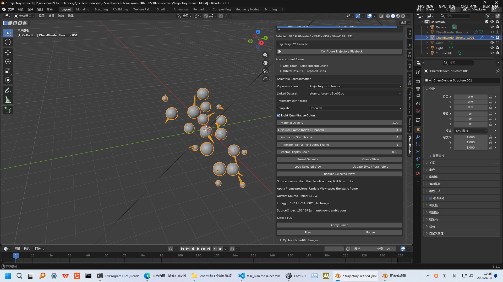

# T06: aspirin trajectory and same-frame forces

This lesson follows one route from the fixed extXYZ input through Prepare, two trajectory Views, frame checks, playback, rendering and a portable paired project.

Gray is carbon, red is oxygen, white is hydrogen and yellow arrows show atomic forces. The input has no prepared bonds, so this view displays atoms and arrows. Some arrows overlap atoms in this projection. Light and shading change the displayed colors; this image is not a quantitative color scale.

## Fixed input and prerequisites

Complete [installation](installation.md) and [the first lesson](first-aspirin.md). Use Blender 5.1.1 and Prepare 0.1.0. Download [aspirin-rmd17-32.extxyz](../../../examples/user-workflows/inputs/extxyz/aspirin-rmd17-32.extxyz), its [source and license note](../../../examples/user-workflows/inputs/extxyz/aspirin-rmd17-32.md), and the [frozen specification](../../../examples/tutorials/2.5.0/T06.case-spec.json). The source note contains older Quick Import instructions; use the CBQ route below for 2.5.

| Item | Reference |
| --- | --- |
| Input SHA-256 | `95ad7342776441a9ce2d524a65351dad8b8e29ab40857b4ed858d17ab71a409a` |
| Source | CC0 rMD17 v3 aspirin; NPZ rows 0, 100, …, 3100 |
| Shape | 32 frames × 21 atoms × 3 components |
| Coordinates | angstrom |
| Forces | electron_volt_per_angstrom |
| Energy | electron_volt |
| step | dimensionless array-row identifier |
| source_index | Original index; unit unknown and semantic status ambiguous |
| Physical time interval | Not supplied; label by source frame, never ps |

## Prepare the CBQ

Put the input in a new lesson folder. In Prepare, use the installed Standard runtime Python:

1. Choose `inspect`, paste the extXYZ path into the input field and set Reader ID to `extxyz`. Click `执行` (Execute). Changing operation rearranges the form; locate the button again before clicking. Expect `success`, frame_count `32`, atomic_force and frame properties energy/source_index/step.

2. Choose `convert`, retain the input and Reader ID, set Input Type to `files` and Validation Mode to `balanced`. Enter a new output CBQ path and click `执行`. Expect `success`; the no-prepared-bonds diagnostic is consistent with the atom/arrow View below.

Expect success and a FrameSet with `coordinates`, an `atomic_force` AtomFrameProperty, and frame properties `energy`, `step`, `source_index`. All stored coordinates, forces and numeric frame properties matched independently parsed input text exactly. Atom species/order stayed constant across all 32 frames. Preserve the ambiguous source_index status; a successful conversion does not supply missing units.

## Create and inspect the trajectory

1. In a new scene, set `CBQ Package`, confirm the path, then use `Preview CBQ` and `Import CBQ`. Expect nine new entities.
2. Select the FrameSet in Project Browser. Under `Scientific Representation`, retain `Automatic` and `Research`; the description reads `Trajectory frame`. Click `Create View`.
3. Select the `atomic_force` dataset. `Automatic` now resolves to `Trajectory with forces`. Click `Create View` again. This creates a separate View bound to the same FrameSet and its force property.
4. Hide the earlier plain trajectory View in viewport and render, retaining it in the project. Hide the default Cube in both places. Select the force View and frame it with numpad `.`. Overlapping Views at different frames can otherwise look like extra atoms.
5. In the force View controls, set `Source Frame Index (0-based)` to `15`, then click `Apply Frame`. The preview updates coordinates and force arrows together. Check frames `0` and `31` in the same way; the captures below show both endpoints.

[Endpoint checks](../assets/2.5-tutorials/trajectory-first-last-check.json) confirm coordinates and scaled forces within display tolerance.

When inspecting all 32 frames, display vertices and vectors should match the corresponding source arrays within `1e-6` at display precision, while authoritative arrays remain unchanged. When Vector Display Scale differs from 1, compare displayed vectors against source force multiplied by that scale.

| Source frame | Energy, eV | step | source_index |
| --- | --- | --- | --- |
| 0 | -17617.8287419 | 0 | 161596 |
| 15 | -17617.4879446 | 1500 | 26491 |
| 31 | -17617.7618802 | 3100 | 151469 |

These are dataset references, not energies recomputed by Blender. `source_index` remains explicitly `unit unknown; ambiguous`.

The final local candidate exposes those existing FrameProperty values as read-only rows. The widened sidebar keeps every value and the `unknown; ambiguous` boundary readable:

## Play and pause

Scroll within the sidebar until `Play` and `Pause` appear below `Apply Frame`. Keep Animation Start Frame `1` and Timeline Frames Per Source Frame `1`. Click `Play`: the timeline range becomes 1–32, with source frame equal to timeline frame minus one. Click `Pause` to stop both timeline and scientific playback.

`Apply Frame` previews a static source frame. The scene timeline can show another number while paused; use the source-frame control and saved View metadata when identifying that preview. A display rate of 24 fps does not establish the missing physical sampling interval or statistical independence of these selected configurations.

## Refine and render

1. On the selected force View, use `Load Selected View`, set Vector Display Scale to `0.35` and enable `Light Quantitative Colors`, then `Update Style / Parameters`. This smaller arrow scale is a display choice, not a force-unit conversion.
2. Open Geometry Nodes for the force View's `ChemBlender Ball and Stick` modifier. In its existing `CH_Ball and Stick` group, set `Subdivision` to `5`; keep source coordinates and forces intact.
3. In the same node editor, press `Shift+A`, search for `Set Shade Smooth`, and insert it after `ChemBlender Scientific Atom Material`. Wire `Group.001: Ball and Stick` → `ChemBlender Scientific Atom Geometry` → `ChemBlender Scientific Atom Material` → `Set Shade Smooth: Mesh` → `Join Geometry`. Keep the separate `ChemBlender Vector Instances` link into `Join Geometry`. Remove the old direct atom-material-to-Join link, otherwise the flat and smooth atom branches overlap and double the faces from 21,000 to 42,000.

4. In Camera properties choose `Orthographic`, set Location `(0, -16, 11)`, Rotation X `0.968509` radians, Y/Z `0`, and Orthographic Scale `11`. Put the Point Light at `(0, -16, 11)`, Power `14000`, Radius `3`. Add an Area light named `Tutorial Fill` at `(5, 4, 8)`, Shape `Disk`, Power `1800`, Size `8`; aim it at the origin. In World properties set Background linear RGB to `(0.18, 0.18, 0.18)` and Strength `1`.
5. In Render Properties choose Cycles, Device `CPU`, Render Samples `256`, and enable denoising. In Output Properties set `2400×1800`, `100%`, File Format `PNG`. Apply source frame 15, press `F12`, then use `Image → Save As…`; save the paired `.blend` beside its complete `.cbq` directory.
6. For animation, configure playback first, press `Pause` without disabling the scientific playback flag, set Start/End to `1`/`32`, choose a new `//frames-refined/frame_` PNG output and use `Render → Render Animation` (`Ctrl+F12`). In a separate Video Editing scene use `Add → Image/Sequence`, select the 32 PNG files in filename order, set 24 fps and the same 2400×1800 size, then choose `FFmpeg Video`, container `MPEG-4`, codec `H.264`, output `//trajectory-refined.mp4`, and render the animation.

Rebuild or Update can replace display objects. Reapply Subdivision 5 and the single Set Shade Smooth node branch after such replacement; inspect the node links before rendering. More display polygons or smoother normals do not add new scientific samples.

## Handover and recovery boundaries

The working pair is `trajectory-refined.blend` plus the complete `trajectory-refined.cbq` directory. Retain the static PNG and full PNG sequence separately. Copy or move the pair and frame folder together, then quit Blender and reopen the copied `.blend` in a new process. Scientific playback is disabled after loading; start it explicitly before playing. If derived geometry is missing, select the force View and use `REBUILD`, then `Load Selected View`, set Source Frame Index to `15`, and click `Apply Frame`. Reapply cosmetic nodes after a rebuild; never delete authoritative `.npy` arrays as display-cache repair.

## Validation appendix

The accepted run-009 evidence uses Extension SHA-256 `a1e2da79253d505b60daa42aa465eb725cdd1eba00e6c81ce4082102a62d0f28` and Prepare wheel SHA-256 `b736bc61ecdbee77f61696576c98092afc7352a9af16b4367bfd3c2e3159af3a`. [Prepare GUI](../../../examples/tutorials/2.5.0/T06-run009-gui-check.json), [GUI-output science](../assets/2.5-tutorials/trajectory-gui-science-check.json), [all-frame View](../../../examples/tutorials/2.5.0/T06-run009-view-check.json), [force](../assets/2.5-tutorials/trajectory-force-check.json), [playback](../../../examples/tutorials/2.5.0/T06-run009-playback-gui-check.json), [rebuild](../../../examples/tutorials/2.5.0/T06-run009-rebuild-check.json) and [offline recovery](../../../examples/tutorials/2.5.0/T06-run010-offline-recovery-check.json) records remain separately bound. The equivalent CLI inspect/convert/validate path also passed but is audit evidence, not a second tutorial route. The final-candidate [direct GUI receipt](../../../examples/tutorials/2.5.0/T06-run013-direct-gui-check.json) binds readable scalar-row captures at source frames 0, 15 and 31 plus a continuous OS GUI recording; it does not repair or hide the invalid historical run manifest.

The local `T06-review.zip` contains the paired project, render, 32-frame sequence, relative VSE assembly, MP4, bilingual handover and evidence; SHA-256 `8eea79a46ea7967bda201619dbb066e6a2908315bdc9c884c1c4844284c8003a`. Its [package record](../../../examples/tutorials/2.5.0/T06-run009-package-check.json) is review-only, not final distribution. [Animation](../../../examples/tutorials/2.5.0/T06-run009-animation-check.json), [video integrity](../assets/2.5-tutorials/trajectory-video-check.json), [portable video](../../../examples/tutorials/2.5.0/T06-run009-portable-video-check.json), [cold reopen](../assets/2.5-tutorials/trajectory-cold-recovery.json), [cache rebuild](../assets/2.5-tutorials/trajectory-cache-recovery.json), the retained [Smooth by Angle experiment](../assets/2.5-tutorials/trajectory-smooth.jpg) and [media provenance](../assets/2.5-tutorials/provenance.json) remain audit material. A cancelled pre-render audit was a timing issue: `render_post` and explicit static comparison matched the correct source frame. Independent human replay remains pending.

Final local candidate applicability: Extension SHA-256 `73fe2c248a7c1ad939018ce21a4ae44c52855abbdaff124af581bd34ffe469c8`; Prepare wheel SHA-256 `3ca42c26be19aebc5444d5df5a0490a15d3da6c370f2c4ec6883921a3e8880e3`. Historical receipts above retain the bytes actually exercised; [the final diff mapping](../../../examples/tutorials/2.5.0/P6-final-candidate-applicability.json) does not relabel them as new GUI events.
