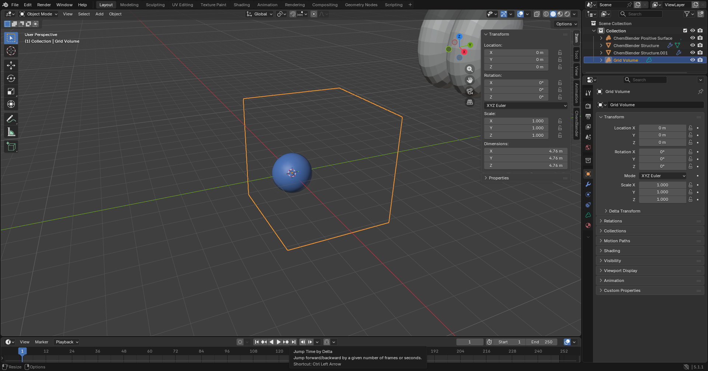

# Blender End-to-End SOP

This screenshot was captured directly with `bpy.ops.screen.screenshot` from the isolated, newly installed 2.5.0 ZIP after CBQ import, pure-Mesh Apply, View creation, save and reopen. The visible ChemBlender-owned Structure, Surface and Grid Volume objects come from that installed instance.

1. Run `chemblender-prepare doctor --json`; Standard must pass. Optional warnings are expected unless you configured those backends.
2. Find the launcher with `uv tool dir --bin`, configure its absolute `chemblender-prepare.exe` path, and run **Test Processor**. Confirm processor `0.1.0`, protocol `1`, Standard complete, and operation/reader counts.
3. Use the CLI or GUI to inspect and convert a raw file into a new `.cbq` directory. In the GUI, **derive** keeps an operation ID plus JSON parameters as the expert surface.
4. In ChemBlender, Preview and import the CBQ. Select the scientific entity in Project Browser.
5. For geometry changes, edit the generated Mesh, then use **Apply** to create a new derived Structure. Imported structures and old Views remain unchanged.
6. Run a supported external operation. The modal task must show progress, support Cancel, verify project revision/hash, and append a new result rather than replacing the previous result.
7. Create Structure, Surface, Volume, trajectory, spectrum, or other Views only when the selected entity supports them. Configure Cycles and render from the View.
8. Save `project.blend` beside `project.cbq/`. Use Save As or move both together; cold reopen and verify the link, entities, Views, and hashes.
9. Delete a derived render cache and rebuild it from CBQ. Moving the processor or source file must not break existing editing, Views, animation, or rendering.
10. Test cancellation and an invalid processor path. Restore the launcher path, run **Test Processor**, and retry explicitly.

Blender exposes high-frequency Viewer operations only. Operations that belong to conversion or specialist computation stay in CLI/Worker; their absence from a panel is not a missing implementation.
