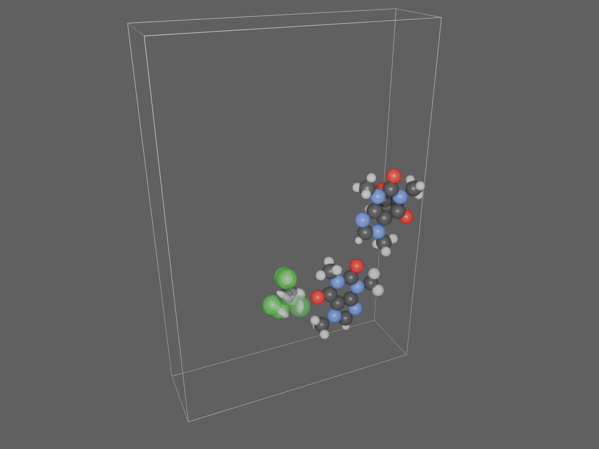
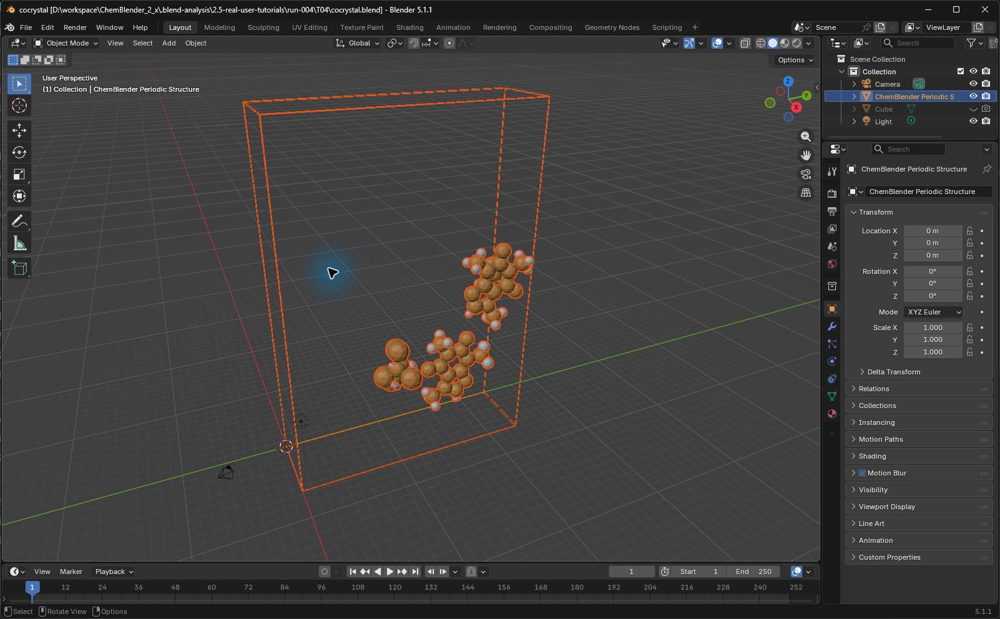
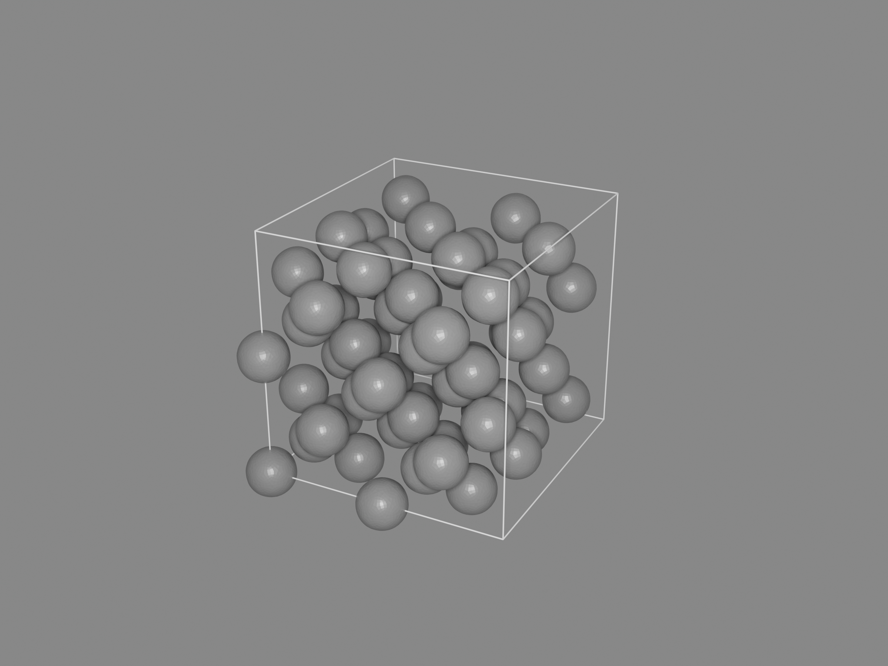

# T04: crystal sites, occupancy and an existing diamond supercell

This lesson is a working draft. Saved scientific data, ASE conversion and original/moved cold reopening passed. Blender import and composition used the authorized replay of previously verified operations; the cell screenshot is an actual capture. Complete step-by-step GUI coverage, visual quality and independent human replay remain pending.



The empty part of this cell is intentional: this view contains the 64 source asymmetric sites, not a symmetry-expanded crystal. Partial occupancy is represented by opacity. Overlapping disordered sites are retained. Fine shading facets remain visible in this draft.

## Prerequisites and fixed inputs

Complete [installation](installation.md) and [the first lesson](first-aspirin.md). This case uses Blender 5.1.1, prepare 0.1.0 and candidate ZIP SHA-256 `963b905f3e5ee3c5fc1fa53a1ccefd5c60616d89ac77977efe4afdbed066426a`. It contains the periodic Create View correction; earlier candidates can omit the cell display. The prepare wheel remains `3f1d93acd0eefd29bc304527007b8d53bd0aa3b508e97aea0a18f4624ee62c3e`.

Download the [COD 4503272 CIF](../../../examples/user-workflows/inputs/cif/cod-4503272-caffeine-cocrystal.cif) and [diamond CONTCAR](../../../examples/user-workflows/inputs/poscar/cod-9012293-diamond-2x2x2.CONTCAR). Keep the [case specification](../../../examples/tutorials/2.5.0/T04.case-spec.json), which contains their hashes and comparison tolerances. The CIF is a CC0 COD source; the diamond input is an existing repository 2×2×2 derivation of the COD 9012293 conventional cell, not a new simulation.

| Check | Cocrystal | Diamond |
| --- | --- | --- |
| Source sites | 64 asymmetric sites | 64 carbon atoms |
| Cell lengths, Å | 6.6439, 23.2514, 33.5615 | 7.1338 on each axis |
| Cell angles | 90° on each axis | 90° on each axis |
| Occupancy/disorder | 23 partial occupancy sites; 9 disorder-group sites | Fully occupied sites |
| Source interpretation | Declared C m c a, number 64, 16 operations | Direct fractional coordinates; 8 conventional-cell atoms × 8 cells |
| Velocity boundary | No velocity claim | Synthetic 64×3 zero array; native reader reports unknown unit |

## Prepare and check

Create a new folder such as `D:\ChemBlenderLessons\T04`. The following public CLI route was executed with the fixed inputs. Substitute your actual input paths and use a new output directory for each conversion.

```powershell
chemblender-prepare inspect "D:\ChemBlenderLessons\T04\cod-4503272-caffeine-cocrystal.cif" --reader cif --json
chemblender-prepare convert "D:\ChemBlenderLessons\T04\cod-4503272-caffeine-cocrystal.cif" --reader cif -o "D:\ChemBlenderLessons\T04\cocrystal.cbq" --json
chemblender-prepare validate "D:\ChemBlenderLessons\T04\cocrystal.cbq" --json
chemblender-prepare inspect "D:\ChemBlenderLessons\T04\cod-9012293-diamond-2x2x2.CONTCAR" --reader poscar --json
chemblender-prepare convert "D:\ChemBlenderLessons\T04\cod-9012293-diamond-2x2x2.CONTCAR" --reader poscar -o "D:\ChemBlenderLessons\T04\diamond.cbq" --json
chemblender-prepare validate "D:\ChemBlenderLessons\T04\diamond.cbq" --json
```

Expect `status: success`. Native conversion retained CIF row order, labels, occupancy, disorder and source bytes. Independent source fractional coordinates multiplied by the lattice matched saved Cartesian coordinates exactly. The frozen absolute tolerance is `1e-7` Å. Blender display vertices use lower precision; their cold-reopen errors below `1e-6` do not change the authoritative arrays.

The Prepare GUI route for these two files still needs its own capture. Follow the first lesson's `inspect` and `convert` layout, supply `cif` or `poscar` as Reader ID and retain each diagnostic. The CLI results above are not GUI evidence.

## Import and frame the complete cell

1. In a new lesson scene, open the `ChemBlender` sidebar. Set `CBQ Package` to `cocrystal.cbq`, confirm the path, then use `Preview CBQ` and `Import CBQ`.
2. Select the Structure in Project Browser. Under `Scientific Representation`, use `Automatic`, `Research`, then `Create View`. Expect `ChemBlender Periodic Structure` with Cell, Site Occupancy and Thermal Ellipsoids display children. The source-site representation retains the declared cell and occupancy; it does not generate symmetry copies.
3. Hide the default Cube in both viewport and render. In the Outliner, expand the periodic object and select the parent plus its three display children. Place the pointer over the viewport and press numpad `.` to frame the selection. Framing only the source atoms can crop the cell.



4. Save `cocrystal.blend` beside the complete `cocrystal.cbq` directory. Start a fresh scene in the same tutorial process and repeat with `diamond.cbq`; save that pair as `diamond.blend` and `diamond.cbq`.

## Display refinement and render

The recorded refinement selected the **Site Occupancy display child**, then used Object Mode `Ctrl+2` to add native Subdivision Surface after Geometry Nodes, with viewport and render levels 2. This operation was tried through Computer Use and then replayed for the other structure. It changes derived display geometry; do not use Apply Mesh as New Structure for cosmetic refinement.

Set the occupancy material's Principled roughness to `0.35`. Retain its element-color and occupancy-alpha connections. This is not the Ball and Stick node's Subdivision control. Some facets remain in the current result; subdivision alone does not establish smooth shading or scientific accuracy.

| Render setting | Cocrystal | Diamond |
| --- | --- | --- |
| Camera location | (46.5121, -6.6301, 39.4282) | (18, -24, 18) |
| Camera orientation | Euler XYZ radians (1.108752, 0, 1.154878) | Aim at cell center (3.5669, 3.5669, 3.5669) |
| Focal length | 35 mm | 50 mm |
| Point light | Camera location, Power 100000, Radius 5 | Camera location, Power 100000, Radius 2 |
| World Background | Linear RGB (0.12, 0.12, 0.12), Strength 1 | Linear RGB (0.25, 0.25, 0.25), Strength 1 |
| Output | 2400×1800, 100%, PNG | 2400×1800, 100%, PNG |
| Engine | Cycles CPU, 256 samples, denoising | Cycles CPU, 256 samples, denoising |

These are Blender display values; World linear RGB is not the color picker's Perceptual HSV Value. Use camera view to check all cell edges before F12. Save the completed image separately with `Image → Save As…`, then save the paired project. Composition and material settings were replayed through MCP; their complete manual panel path still needs verification.



This image shows the supplied supercell. It does not demonstrate a supercell generator, bond inference, molecular dynamics or a higher-resolution scientific calculation.

## ASE comparison and scientific boundaries

The optional backend route is mandatory for this case's acceptance. An existing ASE 3.29.0 / NumPy 2.2.6 environment, with an explicit `scientific` Python route, converted the same CONTCAR through `--reader ase-structure`. Frozen prepare and CBQ core code were byte-verified in a local package-only overlay because three files in that environment's existing prepare differed from the candidate. No dependency was installed. This is a controlled replay, not a claim that an unconfigured Standard installation provides ASE.

The [ASE numerical check](../assets/2.5-tutorials/crystal-ase-science.json) reports zero cell and coordinate error. Preserve the `ase-structure.unsupported` atom-array diagnostic: that route does not validate velocity normalization. Use the native-reader result for this case's explicit unknown-unit zero-velocity boundary.

More display polygons improve silhouettes but add no scientific samples. Finer volumetric data must come from a separately recorded backend calculation with fixed units, domain, spacing and convergence checks. Neither crystal input here is a volumetric grid. Do not smooth away disorder, alter occupancies, infer missing bonds silently or claim that declared symmetry has been independently determined.

## Handover and recovery

Quit the tutorial process normally before opening either saved pair in a new process. Move the `.blend` file together with its entire same-name `.cbq` directory. Four serial original/moved cold audits passed: 64 atoms, 12 cell edges, retained level-2 subdivision, relocated array paths and unchanged scientific hashes. See the [recovery record](../assets/2.5-tutorials/crystal-cold-recovery-refined.json).

If a cell is absent, check the candidate version and select the periodic Structure before creating its View. If the cell is clipped, frame all display children. If arrays are missing after moving, restore the complete paired directory. Keep the separately saved PNG; an empty Render Result after reopening is not evidence that the saved image was lost.

On separate copies, clearing the four owned display meshes and invoking the public `REBUILD` Operator restored 64 sites and 12 cell edges without changing scientific arrays. Both rebuilt pairs passed another cold reopen. See the [derived-geometry recovery record](../assets/2.5-tutorials/crystal-cache-recovery.json). This was a native Operator replay, not a GUI deletion demonstration. Rebuilding replaces the display objects: the manually added Subdivision modifier was absent afterward. Reapply the lesson’s cosmetic refinement after a rebuild; keep the original refined pair as the visual reference.

Complete GUI capture, visual quality, independent human replay and the distributable case package remain pending. Keep this lesson marked as a draft until those gates and visual review pass. [Media provenance](../assets/2.5-tutorials/provenance.json) records the current candidate separately from earlier lessons.
