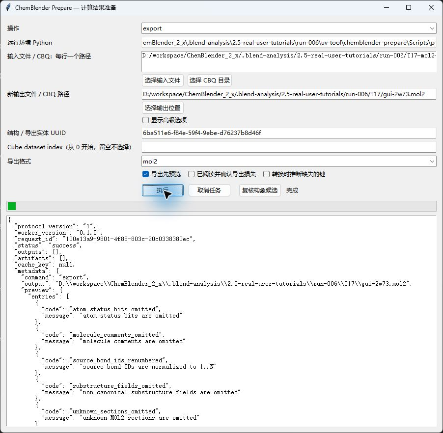
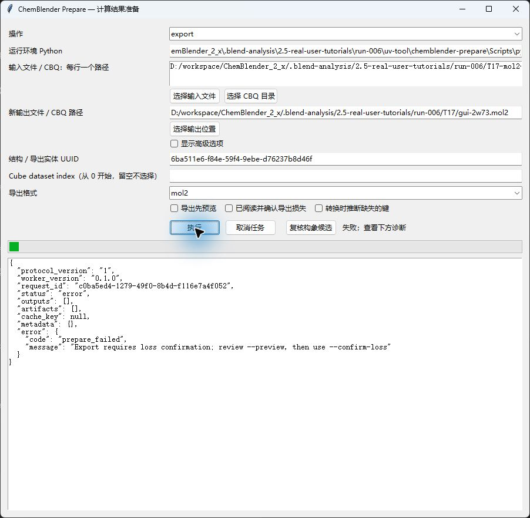
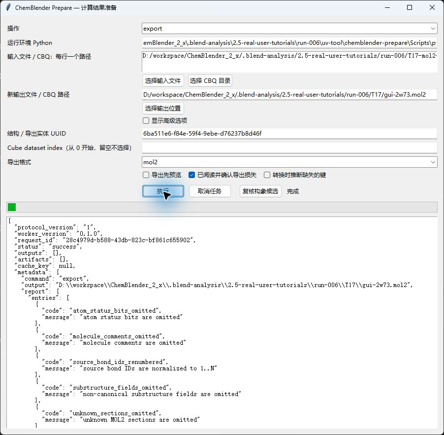

# T17: export scientific data with explicit loss checks

Working draft. All 13 formats have installed CLI export/readback and actual Prepare GUI export evidence. Each GUI output is byte-identical to its scientifically checked CLI output. Advanced options beyond those listed below, project recovery and independent human replay remain pending. This lesson does not yet qualify a Blender project handoff.

## Fixed input and processor

Use [Standard prepare](installation.md). This run uses prepare 0.1.0 candidate wheel SHA-256 `cdb056514b7b9eed068aa96cd95dd2d12c8b183e753350b7fc6b424fd513c56b`; the older 0.1.0 wheel does not include the molecular stereo and PQR fixes. The candidate is locally qualified, not published.

Download [Ligand.mol2](../../../examples/tutorials/2.5.0/inputs/mdanalysis-2w73/Ligand.mol2), [source note](../../../examples/tutorials/2.5.0/inputs/mdanalysis-2w73/README.md), [LICENSE](../../../examples/tutorials/2.5.0/inputs/mdanalysis-2w73/LICENSE), and [case specification](../../../examples/tutorials/2.5.0/T17-mol2-2w73.case-spec.json). Its SHA-256 is `d8e8c7c3435ebd6922c6e9907979e55f7729763c64333b6384ffbf5424a80d48`: 297 atoms, 297 bonds, 17 substructures. The source labels it a 2W73 ligand with GAST_HUCK charges; this is existing prepared data, not a new calculation.

In a new working directory containing the input, run these public commands. Keep the complete `ligand.cbq` directory.

```powershell
chemblender-prepare convert Ligand.mol2 --reader mol2 -o ligand.cbq --json
chemblender-prepare inspect ligand.cbq --json
```

Copy the UUID of the Structure from the result. Use your returned UUID; screenshots show the recorded run's UUID. Conversion and inspection above are CLI steps, not claimed as MOL2 GUI evidence.

## Actual Prepare export steps

1. Open Prepare. Set **Operation / 操作** to `export` and **Runtime Python / 运行环境 Python** to the Python executable inside the installed candidate environment. This field expects Python, not `chemblender-prepare.exe`.
2. Use the file picker or enter the absolute path to `ligand.cbq` in **Input files / CBQ**, and an absolute path to a new `ligand-exported.mol2` for the output, the entity UUID to the Structure UUID, and **Export format** to `mol2`. Leave **Cube dataset index** empty.
3. Keep **导出先预览** checked and click **执行**. Expect `success`, a preview report and no output file.



The preview lists omitted atom status bits, comments, noncanonical substructure fields and unknown sections; bond IDs are renumbered. All 17 substructure roots are normalized to the first atom of each group and emitted as GROUP, while group IDs/names and atom membership remain. This is not a lossless export.

4. Uncheck **导出先预览**. Leaving **已阅读并确认导出损失** unchecked and clicking **执行** must reject the export without creating the file.



5. After reviewing those losses, check **已阅读并确认导出损失** and click **执行**. Expect `success` and the output file.



6. Reimport through the public CLI into another new directory:

```powershell
chemblender-prepare convert ligand-exported.mol2 --reader mol2 -o reopened.cbq --json
chemblender-prepare validate reopened.cbq --json
```

Our GUI output is byte-identical to the scientifically checked CLI output: coordinates and supplied charges have maximum error 0; all atom names/types/group references and indexed bond types match. See [scientific checks](../../../examples/tutorials/2.5.0/T17-mol2-2w73-check.json) and [GUI receipt](../../../examples/tutorials/2.5.0/T17-gui-mol2-check.json).

## Format coverage and boundaries

| Format | Fixed input / check |
| --- | --- |
| xyz, extxyz | Aspirin: 21 atoms, coordinates/order exact |
| mol | Aspirin: coordinates, identity and indexed molecular graph match |
| mol2 | 2W73: 297 atoms/bonds, confirmed losses above |
| pdb | Ubiquitin: 10 frames × 1231 atoms; all coordinates, occupancy, B factors and hierarchy match; unit cell omitted with confirmation |
| pqr | APBS protein–RNA: 998 charges/radii exact, 22 zero radii, 41 residues and two inferred segments retained |
| sdf | Selected CCD molecule: coordinates/identity/graph and title match; its empty property list does not test nonempty SDF properties |
| smiles | Paclitaxel: canonical isomeric graph matches; coordinates are not retained |
| cif, poscar | Cocrystal / diamond: coordinates and cell matrices exact |
| cube | Analytic H2: all 262144 samples, origin and steps exact; assign physical semantics again after import |
| cjson, qcschema | JSON values match original envelopes |

Use the [13-format specification](../../../examples/tutorials/2.5.0/T17.case-spec.json), [installed-run receipt](../../../examples/tutorials/2.5.0/prepare-run006-check.json), and [additional scientific checks](../../../examples/tutorials/2.5.0/T17-science-run006-check.json). MOL2's positive supplement is the 2W73 specification above. The [native metadata checks](../../../examples/tutorials/2.5.0/T17-metadata-run006-check.json) cover PDB/PQR hierarchy and the selected SDF record. Positive format coverage does not prove every advanced option.

## Verified GUI settings

Use the same preview → inspect → export sequence. These receipts bind the actual screenshots to the candidate hash.

| Format / receipt | Recorded setting or boundary |
| --- | --- |
| [xyz](../../../examples/tutorials/2.5.0/T17-gui-xyz-check.json) | Confirm omitted topology, identity and metadata |
| [extxyz](../../../examples/tutorials/2.5.0/T17-gui-extxyz-check.json) | Advanced missing-value token left blank; adds a panel row |
| [mol](../../../examples/tutorials/2.5.0/T17-gui-mol-check.json) | No confirmation required for this sample |
| [mol2](../../../examples/tutorials/2.5.0/T17-gui-mol2-check.json) | Confirmed losses described above |
| [pdb](../../../examples/tutorials/2.5.0/T17-gui-pdb-check.json) | All 10 models; confirmed unit-cell omission |
| [pqr](../../../examples/tutorials/2.5.0/T17-gui-pqr-check.json) | Confirmed segment-index omission; source charges retained |
| [sdf](../../../examples/tutorials/2.5.0/T17-gui-sdf-check.json) | Selected record only; no confirmation required |
| [smiles](../../../examples/tutorials/2.5.0/T17-gui-smiles-check.json) | Confirm coordinate/order/title/raw-record/property omissions |
| [cif](../../../examples/tutorials/2.5.0/T17-gui-cif-check.json) | Advanced CIF mode: preserve |
| [poscar](../../../examples/tutorials/2.5.0/T17-gui-poscar-check.json) | Advanced fields blank: defaults; nondefault options untested |
| [cube](../../../examples/tutorials/2.5.0/T17-gui-cube-check.json) | Single dataset, index blank; confirm semantics/unit omissions |
| [cjson](../../../examples/tutorials/2.5.0/T17-gui-cjson-check.json) | Original envelope JSON values retained |
| [qcschema](../../../examples/tutorials/2.5.0/T17-gui-qcschema-check.json) | Original envelope only; derived project fields excluded; no new compute |

## Recovery and scientific limits

After changing input, verify the entity UUID again: the recorded SDF attempt initially retained a UUID from the previous input and was rejected. Copy the current input's UUID, preview again, then export. Changing format changes visible controls; use their labels, not fixed screen coordinates.

Keep source files, source CBQ and exported files separate. If the destination exists, choose a new name. If loss confirmation is required, inspect the report; confirmation permits listed omissions, not arbitrary scientific changes.

5SUN has an unknown `un` bond and no complete interpreted topology; export rejection is expected. Open Babel mol24 references an undeclared substructure and is rejected on import. Neither rejection counts as positive coverage, and no missing hierarchy or bonds were fabricated.

Normalized MOL2 is a data exchange artifact, not a replacement for a paired `.blend`/`.cbq` project. Keep the authoritative CBQ when handing off work. Render settings and mesh refinement do not increase scientific resolution or repair incomplete topology.
