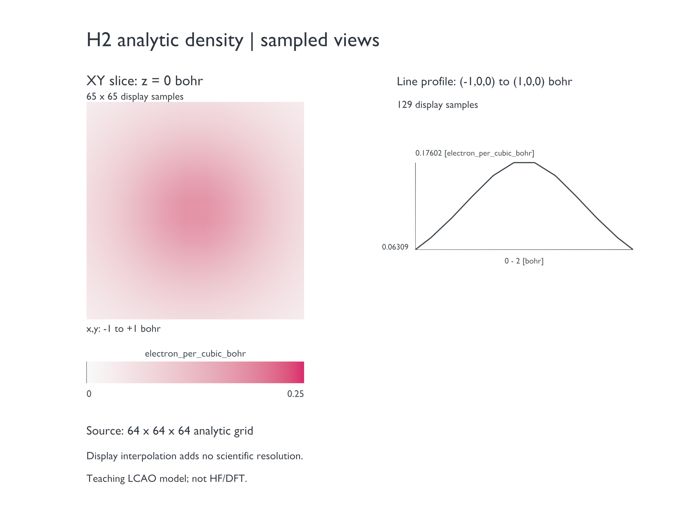
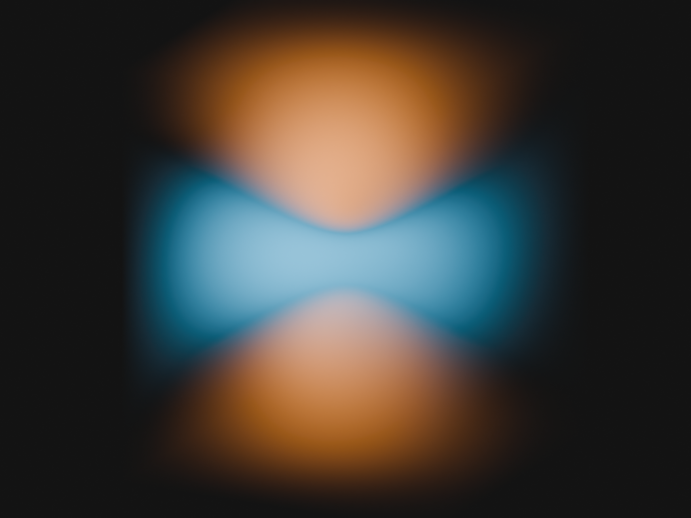

# T07: density grids, slices and signed surfaces

Working draft. Public conversion, five primary Grid Views created through the GUI, signed display, numerical sampling, rendering and serial cold/cache recovery have evidence. Prepare GUI, VASP input, remaining illustrations and independent human replay are pending.


This image shows an analytic teaching density difference, not a molecular orbital or an HF/DFT calculation. The finer surface has smoother contours but still shows interpolation bands. Lighting changes apparent color; the image is not a quantitative color scale.

## Fixed input

Complete [installation](installation.md) and [the first lesson](first-aspirin.md). Use Blender 5.1.1, prepare 0.1.0 and candidate Extension SHA-256 `963b905f3e5ee3c5fc1fa53a1ccefd5c60616d89ac77977efe4afdbed066426a`.

Download [h2-lcao-1s-density-64.cube](../../../examples/user-workflows/inputs/cube/h2-lcao-1s-density-64.cube), its [source/license note](../../../examples/user-workflows/inputs/cube/h2-lcao-1s-density-64.md), and the [frozen case specification](../../../examples/tutorials/2.5.0/T07.case-spec.json). Older source-note import instructions do not replace the CBQ route below.

| Item | Reference |
| --- | --- |
| SHA-256 | `51fcb06343132c4b75f340aa5824434c9c622b51df7ea1ad3742920c78af66b4` |
| Model | Repository analytic H2 bonding 1s LCAO density; GPL-3.0 |
| Shape | 64 × 64 × 64; 262144 samples |
| Coordinates | bohr; origin (-6,-6,-6), diagonal step 0.1904761905 |
| Atoms | H at z = -0.7 and +0.7 bohr |
| Values | electron_per_cubic_bohr; min 7.75746861e-10, max 0.229296377 |
| Rectangular-sum integral | 1.9996717595939106 using serialized steps; approximately 2 electrons |

The Cube nuclear-charge column contains zero placeholders. Do not interpret these as physical nuclear charges.

## Prepare and import

Create a fresh lesson folder and use new output paths. These public commands were verified; replace the example folder. They are CLI evidence, not a recorded Prepare GUI session.

```powershell
chemblender-prepare inspect "D:\ChemBlenderLessons\T07\h2-lcao-1s-density-64.cube" --reader cube --json
chemblender-prepare convert "D:\ChemBlenderLessons\T07\h2-lcao-1s-density-64.cube" --reader cube --preset electron_density --unit electron_per_cubic_bohr -o "D:\ChemBlenderLessons\T07\h2-density.cbq" --json
chemblender-prepare validate "D:\ChemBlenderLessons\T07\h2-density.cbq" --json
```

Expect success with both an original ambiguous `scalar_field` / `unknown` grid and an appended complete `electron_density` grid. The explicit interpretation comes from the fixed input's provenance; Cube alone does not reliably supply quantity semantics. [Independent checks](../assets/2.5-tutorials/grid-science-check.json) matched every scalar, origin and step exactly.

1. In Blender's ChemBlender sidebar, set `CBQ Package`, then `Preview CBQ` and `Import CBQ`. These previously verified actions were replayed through MCP. If the browser has not drawn yet, open the ChemBlender tab; do not import twice.
2. Select the complete Electron Density in Project Browser. Under `Scientific Representation`, verify `Coordinates: bohr` and `Values: electron_per_cubic_bohr`.
3. With `Automatic` resolving to Grid volume, click `Create View`. The recorded display used Density Scale 10. This changes appearance, not the stored density.
4. Choose `Signed scalar isosurface`, keep `Dataset Index` 0, set `Isovalue` 0.05, and click `Create View`. Hide the earlier volume in viewport and render to inspect the surface independently.


All primary values are positive: the positive surface has 882 vertices / 880 faces; the negative surface is empty. This is expected, not a failure of signed rendering.

## Sample a slice, profile and colorbar

Select the complete primary density before each Create. Each operation below was performed through the actual GUI. Keep separate Views, and hide overlapping Views while inspecting one.

| Representation | Settings | Expected check |
| --- | --- | --- |
| Scientific plane slice | Origin (-1,-1,0), U (2,0,0), V (0,2,0), 65 × 65; symmetric range off; color 0 to 0.25 | 4225 valid samples; maximum error 7.404e-9 against independent trilinear interpolation |
| Scientific line profile | Start (-1,0,0), end (1,0,0), 129 samples | Distance label 0–2 bohr; values 0.0630902003 to 0.176022212; maximum error 7.951e-9 |
| Scientific colorbar | Symmetric range off; color 0 to 0.25; width 2, height 0.2 in display angstrom | Endpoints 0 and 0.25; electron_per_cubic_bohr label |

Click `Create View` after setting each representation. Slice/profile coordinates above are bohr. More display samples interpolate the same 64³ field; they do not add scientific information. See the [slice check](../assets/2.5-tutorials/grid-slice-check.json) and [profile/colorbar check](../assets/2.5-tutorials/grid-profile-check.json).



The figure preserves the native profile extrema and distance labels. Its short plateau comes from interpolation of the fixed scientific grid; the curve was not smoothed to hide it. Chinese readers: the left panel is the XY slice, the right panel the line profile, and the lower bar maps density values.

To arrange the existing Views without altering sample arrays, work on a new saved pair. Move the slice root to (-0.75,0.25,0), the profile root to (0.85,0.78,0), and the colorbar root to (-1.279,-0.59,0); scale the colorbar uniformly by 0.52917721. Its endpoint labels remain 0 and 0.25. Hide only the profile's physical Path object in render, retaining its Graph, Axes and labels. Set graph curve bevel depth 0.003, axes 0.0015 and profile label size 0.04. These are cosmetic display coordinates and widths, not replacements for the source coordinates in the table.

Use an orthographic camera at (0,0,8), rotation (0,0,0), scale 3.4; white World; Standard view transform, exposure 0 and gamma 1. Render at 2400 × 1800 with Cycles CPU, 256 samples and denoising. Additional captions identify the source and sampling boundary. This composition used known native scene operations; the earlier screenshots, not this render, prove GUI creation. [Render and cold-reopen record](../assets/2.5-tutorials/grid-sampling-render.json). Custom layout and curve widths may need reapplication after Rebuild.


## Recompute from the fixed input

Download [recompute_t07_difference.py](../../../examples/tutorials/2.5.0/recompute_t07_difference.py), [generate_t07_density_pair.py](../../../examples/tutorials/2.5.0/generate_t07_density_pair.py) and the primary Cube into the same lesson folder. Use an existing Python 3 interpreter; these scripts require only the standard library. Set `--prepare` to the installed executable, not the Blender executable. Replace the paths below; `recomputed` must not already exist.

```powershell
python "D:\ChemBlenderLessons\T07\recompute_t07_difference.py" --prepare "D:\Tools\chemblender-prepare.exe" --source "D:\ChemBlenderLessons\T07\h2-lcao-1s-density-64.cube" --output "D:\ChemBlenderLessons\T07\recomputed"
```

The script verifies the source SHA-256 and performs these public operations in order:

1. Generate a two-dataset teaching Cube; expect SHA-256 `8902b35f01edee818cd794793c152c7bfc766b8d0d08cb794077c9e0deef3b7c`.
2. `convert --reader cube --preset electron_density --unit electron_per_cubic_bohr --dataset-index 0` creates `pair-first.cbq`, retaining the original ambiguous two-dataset grid alongside the complete bonding density.
3. `derive --operation grid.resolve_semantics` takes that ambiguous grid UUID and parameters `{"dataset_index":1,"preset_id":"electron_density","value_unit":"electron_per_cubic_bohr"}` to create `pair-both.cbq`. Both densities now share one Structure. Dataset indices are zero-based 0/1; Cube source IDs 1/2 are not CLI indices.
4. `derive --operation grid.difference --input LEFT --input RIGHT` writes `pair-difference.cbq`. LEFT is bonding density; RIGHT is isolated-atom density. The script reads UUIDs from this run's WorkerResult rather than hardcoding prior IDs.
5. `validate` must succeed. Import the final CBQ into Blender, select the `Difference` / `difference_density` dataset, then follow the signed-surface settings below.

Each step saves the exact CLI argument list (`*.argv.json`) and raw WorkerResult (`*.stdout.json`) plus stderr. A failed command stops the script; inspect those files and use a new output directory after correcting the cause. Do not swap subtraction order. [Replay checks](../assets/2.5-tutorials/grid-recompute-check.json) verified all 262144 values, standalone downloaded scripts and refusal to overwrite an existing result. This is a public CLI recomputation route; a GUI derivation route remains unverified.

## Signed difference result and refinement

The recorded extension example subtracts the sum of two isolated analytic 1s atomic densities from the bonding density, on the same structure and affine grid. The [reproducible input generator](../../../examples/tutorials/2.5.0/generate_t07_density_pair.py) and frozen specification define both datasets. Public `grid.resolve_semantics` and `grid.difference` processing passed, and the CLI recomputation sequence below passed; its GUI derivation route remains pending.

For the recorded difference dataset, choose `Signed scalar isosurface`, set Isovalue 0.005 and click `Create View`. Blue marks positive redistribution, orange negative. The [difference check](../assets/2.5-tutorials/grid-difference-check.json) verifies all 262144 subtractions, with range -0.0345176831 to 0.0204030833. A disposable right grid shifted by 0.1 bohr was rejected for incompatible affine geometry without changing inputs or writing an output.


The actual `Separate Positive / Negative Volume` control was also tested. It uses a signed VDB and two shader branches, not two independent scientific grids. Full VDB values agree with the scientific difference within 1.122e-9 at float32 precision.



To reproduce this volume view, select the difference grid, choose Grid volume, enable `Separate Positive / Negative Volume`, and set `Volume Density Scale` to 100. For an existing volume View, use `Load Selected View`, change the scale and `Update Selected View`. Hide signed surfaces and other Views in both viewport and render. The recorded public LOAD/UPDATE retained the scientific arrays; shader traversal verified `max(100f,0)` and `max(-100f,0)` with no extra Density Attribute multiplication. Blue shows positive redistribution and orange negative redistribution. These optical colors are not a quantitative density scale.

Keep the camera position (4,-8,3) aimed at the origin and increase orthographic scale to 4.8. Aim a 3000 W area light at the origin from (2,-4,5), size 4; add a 1200 W disk area light at (-3,-2,1), size 3, also aimed at the origin. Set World color (0.015,0.015,0.015), strength 0.7. Render using Cycles CPU, 2400 × 1800, 256 samples and denoising. Default scale 10 was too faint in this scene; both earlier scale 10/100 trials remain in local evidence. Increasing optical scale does not recompute or change the VDB. [Array/VDB integrity and cold-reopen evidence](../assets/2.5-tutorials/grid-volume-render.json). Human image review is pending.


For the preview image, the recorded settings were Cycles CPU, 2400 × 1800, 256 samples and denoising; Principled material Roughness 0.32; orthographic camera (4,-8,3) aimed at the origin, scale 3.2; area light (2,-4,5), 450 W, size 4; world color (0.12,0.12,0.12), strength 0.7. Hide unrelated Views in both viewport and render.

In Geometry Nodes, select each signed surface's `Volume to Mesh` node. Change `Resolution Mode` from `Grid` to `Size`, then `Voxel Size` to 0.025. Keep Threshold 0.005. This new control was tested through Computer Use on the positive surface; the same operation was replayed for the negative surface. Counts increased from 490/612 to 8464/9972 vertices. Blender's native length labels follow scene settings; here 0.025 numeric display units map to 0.025 angstrom. The source grid spacing remains approximately 0.1007956592 angstrom. This is display resampling, not a finer scientific calculation.

## Save, hand over and recover

Save `h2-grid.blend` with the adjacent `h2-grid.cbq` directory. Move the entire pair. The recorded pair contains seven View roots. Original and moved copies reopened in separate processes with local VDB paths, scientific hashes and refined surface settings intact. Do not start a second Blender while the current tutorial process is still running.

In a fresh disposable copy only, removal of eight `cache/render` VDB files followed by `Rebuild Selected View` for all seven Views passed through public Operator replay. Independent cold reopening after rebuilding also passed. Never remove authoritative `.npy` arrays. [Recovery receipt](../../../examples/tutorials/2.5.0/T07-recovery-check.json).

Rebuild restores the generated `Grid` resolution: reapply Size 0.025 and any custom material refinement afterward. The original refined project is unchanged. These checks do not yet prove GUI recovery or rebuilding while both original sources and the processor are unavailable; do not label that route fully offline-ready. The distributable case package and independent human acceptance remain pending.
