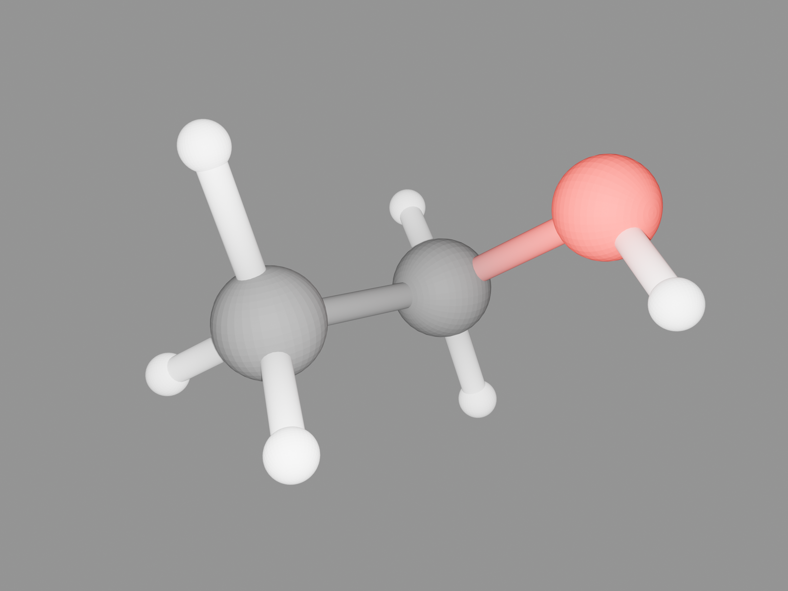
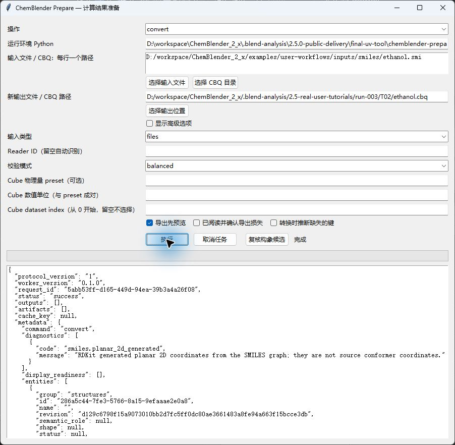
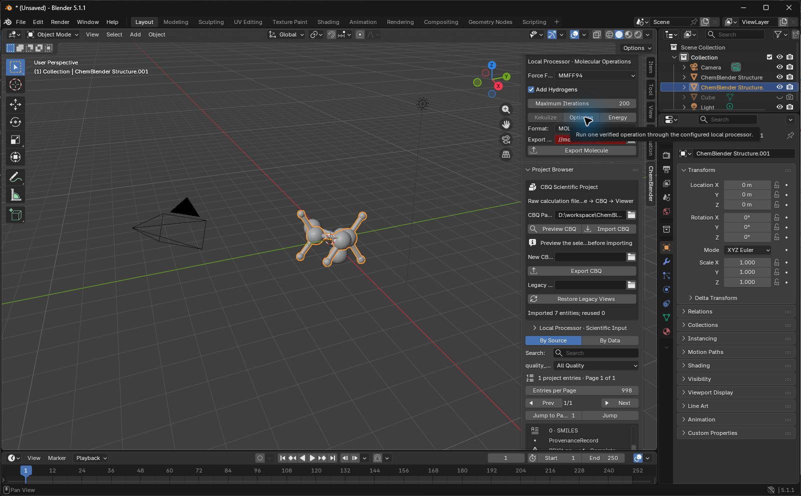
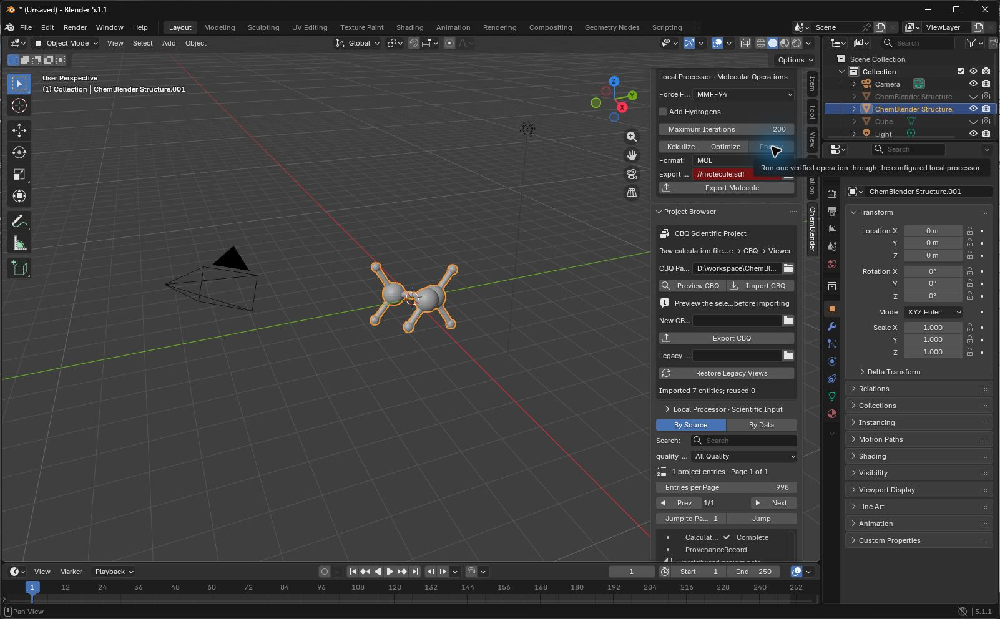
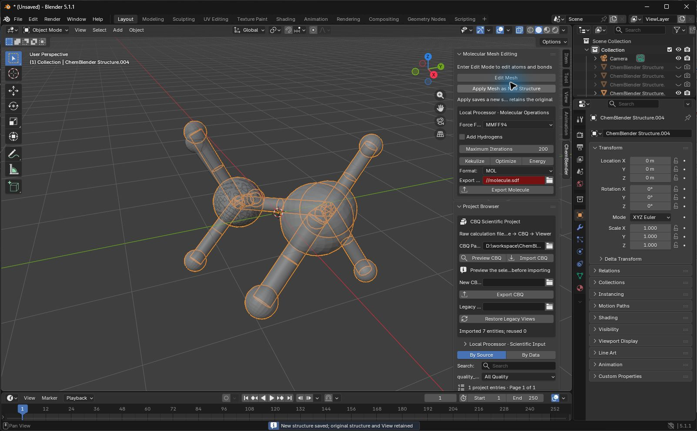

# T02: ethanol conformers, MMFF94 and an explicit mesh edit

This lesson follows one path from `CCO` through 3D generation, MMFF94 operations and an explicit mesh edit to a saved project. The image shows the final **manually edited** structure, not the optimized energy minimum.



Gray is carbon, red is oxygen and white is hydrogen. Nine atoms and eight bonds are visible. Ball sizes, lighting and Blender scene distances are display settings; the scientific coordinates remain in angstrom.

## Prerequisites and fixed input

Complete [installation](installation.md) and learn the sidebar layout in [the first lesson](first-aspirin.md). This lesson requires the Standard processor with RDKit.

Download [ethanol.smi](../../../examples/user-workflows/inputs/smiles/ethanol.smi) into a new folder such as `D:\ChemBlenderLessons\T02\`. It contains `CCO` followed by a newline: a repository-authored synthetic input under GPL-3.0, not an experimental structure. Keep the [frozen case specification](../../../examples/tutorials/2.5.0/T02.case-spec.json) with your records.

| Check | Expected value |
| --- | --- |
| Input SHA-256 | `5c9aa2a3024d56c903d547798cbd04ff743433ba0950dbfd8e19238e40651172` |
| Source coordinates | None; three heavy atoms in a SMILES graph |
| Generated structure | C2H6O, 9 atoms, 8 bonds, angstrom |
| Generation | ETKDGv3, MMFF94, Add Hydrogens enabled, Maximum Iterations 200 |
| Recorded generation defaults | Seed 12648430, one thread; these are recorded implementation defaults, not editable fields in this GUI |
| Optimization | MMFF94, Add Hydrogens disabled, Maximum Iterations 200 |
| Absolute comparison tolerances | Coordinates `1e-7` Å; energy `1e-6` kcal/mol |

## Inspect and convert

1. Open `chemblender-prepare-gui`. Choose `inspect` under 操作. Put the full `ethanol.smi` path in 输入文件 / CBQ：每行一个路径 and click 执行. Expect `status: success` with the SMILES reader.
2. Choose `convert`; retain input type `files`, empty Reader ID and `balanced` validation. Set 新输出文件 / CBQ 路径 to a **new** `ethanol.cbq` directory in the lesson folder, then execute.
3. Wait for 完成 and `status: success`. Read `smiles.planar_2d_generated`: the displayed planar coordinates were generated from connectivity. They are not source conformer coordinates.



## Import and generate a conformer

1. Use a new lesson scene. In `Layout`, open the viewport sidebar with `N`, select `ChemBlender`, enter `ethanol.cbq` in `CBQ Package` and confirm the path with Enter. Click `Preview CBQ`; expect seven new entities. Click `Import CBQ` and confirm.
2. Select the imported Structure in Project Browser. Under `Scientific Representation`, use `Automatic` / `Research` and `Create View`. The initial View is planar.
3. In the Outliner, hide the default Cube both with its viewport eye and its render camera icon. Retain Camera and Light. If the camera column is missing, enable that restriction column from the Outliner filter popover.
4. With the original molecular View selected, find `Local Processor · Molecular Operations`. Set `Force Field: MMFF94`, enable `Add Hydrogens`, leave `Maximum Iterations: 200`, then click `Generate 3D (ETKDG)`. Wait for the new View and completion. The generation button is available on the original SMILES-bound structure; it need not appear on later derived structures.
5. Hide the original View in both viewport and render, keeping it in the project. The selected generated View has nine atoms and eight bonds.



## Energy, optimization and Kekulize

1. On the generated View, disable `Add Hydrogens` because the hydrogens already exist. Click `Energy` and wait for completion. This creates a calculation record; it does not create a new conformation. Project Browser shows its `Complete` badge.
2. Click `Optimize`, wait for the derived View, then click `Kekulize` on that optimized result. Wait for each operation separately. Keep all previous Views but hide their eyes and render cameras so they do not overlap.
3. The recorded run completed optimization in 10 attempted iterations with `optimizer_status: 0`. The generated-geometry MMFF94 energy was `-1.3368570639005273` kcal/mol. Independent evaluation on the saved mapping and coordinates matched exactly; independent optimized-geometry energy was `-1.336857063955483` kcal/mol. The difference is below the stated tolerance. Do not expect a visible shape change when the generated structure is already near a minimum.



See the [recorded numerical checks](../assets/2.5-tutorials/ethanol-science-check.json). These values are references for the fixed backend and input, not measurements. Ethanol has only single bonds here: `Kekulize` checks this operation's execution and connectivity preservation, not aromatic resonance handling.

## Apply one deliberate edit while retaining the source

1. Select the latest View, frame it with numpad `.` and press Tab for Edit Mode. Use vertex selection. Enable X-ray from the viewport toolbar if needed, deselect the other vertices, then select one hydrogen vertex. The recorded run chose atom index 5, shown at the upper left in that run's view; another camera angle changes its screen position.
2. Press `G`, `Z`, type `0.15`, and confirm with Enter. Do not scale or rotate the molecular object. Press Tab to return to Object Mode.
3. In `Molecular Mesh Editing`, click `Apply Mesh as New Structure`. Wait for the derived View. This publishes a new Structure and preserves the old Structure and View. The local mesh draft is not authoritative scientific data until Apply completes.
4. Hide the preceding View in viewport and render; leave the newest edited View visible. Turn X-ray off again. Do not delete old Views to conceal an unexpected change.



The project now contains five Structures and five matching Views. Only hydrogen index 5 moved, by approximately `[0, 0, 0.15]` Å; rounding stayed within `1e-7` Å. Original arrays and the preceding View's binding and coordinates remain unchanged. The final image is this edited geometry: the earlier energy record belongs to the earlier geometry and must not be relabeled as its energy.

## Style, camera and image

1. Select the edited View. In `Geometry Nodes`, place the pointer over the node editor and use `Ctrl+Space` to enlarge it; use Home if nodes are outside the view. On the existing `CH_Ball and Stick` node set `Subdivision` to `5`. Select numeric text with `Ctrl+A` before typing; confirm with Enter. Restore the layout with `Ctrl+Space`.
2. Return to `Layout`. Close the sidebar, use numpad `1` for Front view, then `Ctrl+Alt+numpad 0` to align Camera. Select Camera and set its focal length to `35 mm`. Adjust framing to leave space around every atom.
3. Set output to `2400 × 1800`, `100%`. Select Light: location `(0, -5, 0)`, Point type, Power `5000`, Radius `0.1`. In World Surface, retain Background Strength `1`; open Color and set HSV **Perceptual** Value to `0.6` with Hue and Saturation zero. These values are Blender display settings, not scientific units.
4. Choose `Cycles`, CPU, Render `Max Samples: 256` and render denoising enabled. Keep the default render noise threshold `0.01`. Press F12 and wait for completion. Home fits the Render window. Check all nine atoms are visible; the initial off-axis light left two hydrogen regions difficult to distinguish from the background.
5. Use `Image → Save As…` to save `ethanol-cycles.png` beside the project. Confirm PNG and the destination. Return to the main window and save the project with `Ctrl+S`.

## Handover and recovery

Save `ethanol.blend` beside the complete `ethanol.cbq` directory. Quit this tutorial Blender process normally and start a new process to open the saved file. Keep only one tutorial process running at a time. Check the selected View, all five Structures and their retained Views; viewport hiding is intentional.

If an empty `Render Result` window reappears after opening the project, close that secondary window to see the main scene. Render Result is not the saved PNG; open `ethanol-cycles.png` to view the persistent image or press F12 to render again.

Copy or move the **pair**, including all CBQ arrays. If a derived View is missing, select it and use `Rebuild Selected View`; do not delete authoritative NPY arrays. Reopen the copied `.blend` in a new process and check that every array path resolves below the adjacent copied CBQ directory.

For a standalone integrity check, use the public command below after replacing the example path. Expect `status: success`. Validation does not prove the chemistry, render quality or human reproducibility.

```powershell
chemblender-prepare validate "D:\ChemBlenderLessons\T02\ethanol.cbq" --json
```

If an operation fails, retain its diagnostic and the last saved pair before retrying. If `Generate 3D` is absent, select the original SMILES-bound View. If a render is crowded, check the render camera icons for earlier Views. If an opened project cannot find arrays, restore the complete adjacent CBQ directory; do not invent missing coordinates or delete authoritative arrays as a cache repair.

MMFF94 is a molecular mechanics force field. ETKDG generates a plausible conformer, not a global-minimum proof or quantum calculation. A single energy comparison is meaningful only for the same molecule, atom mapping, units and force field.

## Validation appendix

The current replay used Blender 5.1.1, Standard Prepare 0.1.0 and RDKit 2026.03.3. Extension SHA-256: `a1e2da79253d505b60daa42aa465eb725cdd1eba00e6c81ce4082102a62d0f28`; Prepare wheel SHA-256: `b736bc61ecdbee77f61696576c98092afc7352a9af16b4367bfd3c2e3159af3a`. The [current-candidate applicability record](../../../examples/tutorials/2.5.0/T02-current-candidate-check.json) covers the fixed science values, Apply, render, moved-pair rebuild with a deliberately unavailable processor and clean cold reopen with copied-local array paths. GUI JPEGs remain historical native captures; [T02.current-execution-supplement.json](../../../examples/tutorials/2.5.0/T02.current-execution-supplement.json) records current CLI/Operator replay without relabeling it as direct GUI. [Media provenance and hashes](../assets/2.5-tutorials/provenance.json) remain separate. Independent human replay is pending; the local review package is review-only, not a distribution artifact.

Final local candidate applicability: Extension SHA-256 `73fe2c248a7c1ad939018ce21a4ae44c52855abbdaff124af581bd34ffe469c8`; Prepare wheel SHA-256 `3ca42c26be19aebc5444d5df5a0490a15d3da6c370f2c4ec6883921a3e8880e3`. Historical receipts above retain the bytes actually exercised; [the final diff mapping](../../../examples/tutorials/2.5.0/P6-final-candidate-applicability.json) does not relabel them as new GUI events.
