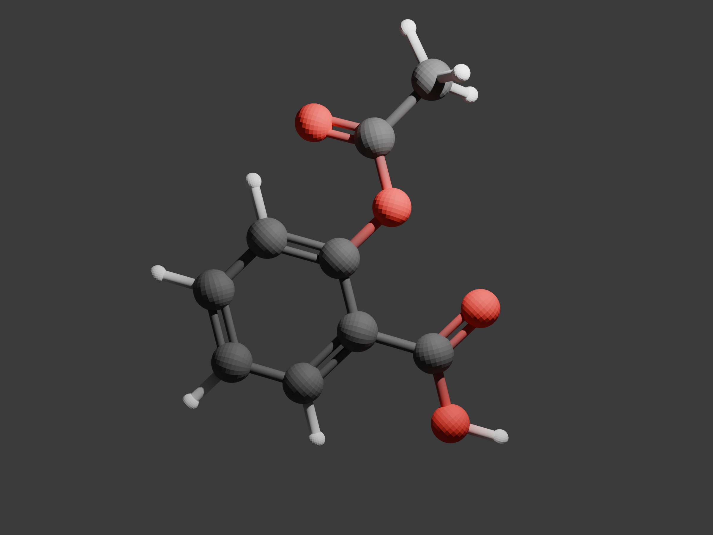
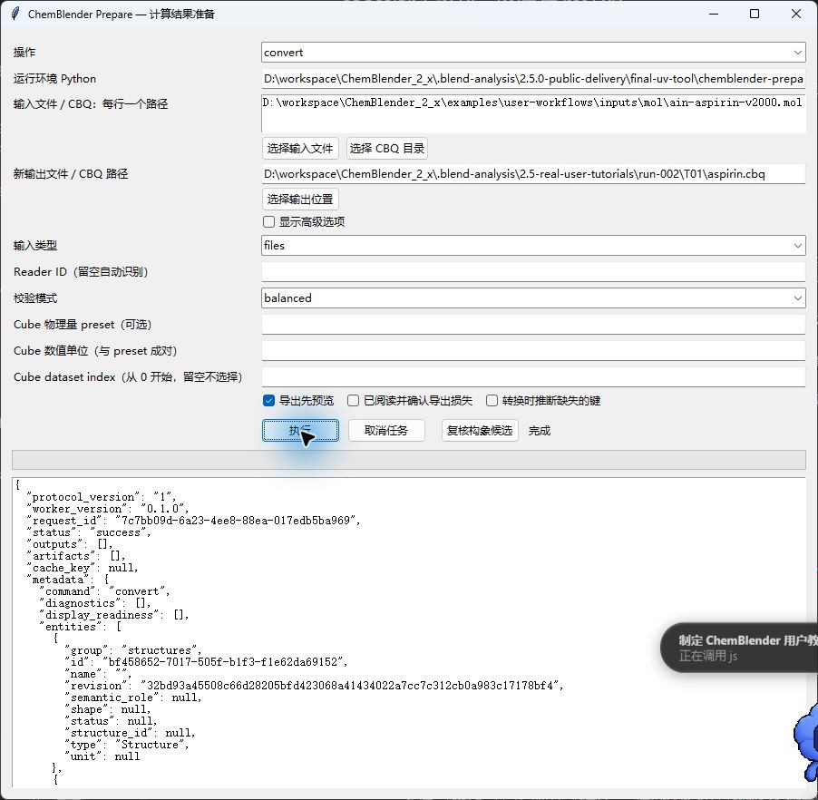
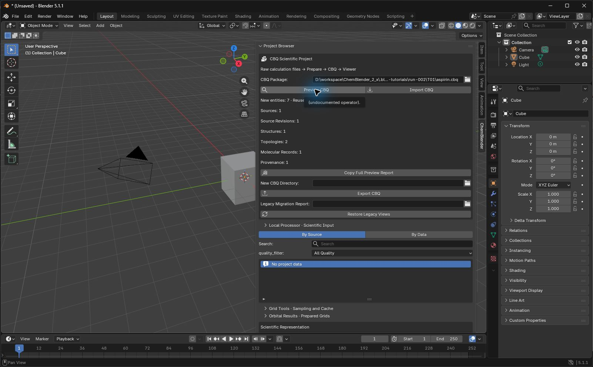
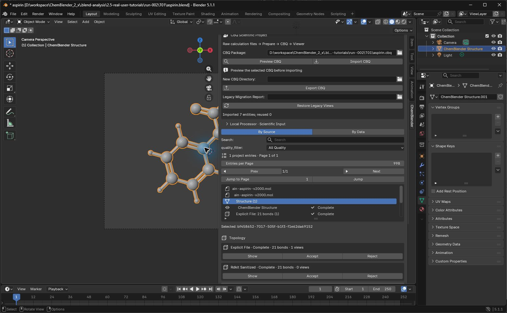

# First lesson: aspirin, from MOL to a reopenable scientific image

The Agent completed real GUI operations, scientific checks, a Cycles render and reopening in a new process. Independent human replay is still pending. These captures use Blender 5.1.1 with the tutorial candidate fix; they are not evidence for the older release ZIP.

Gray is C, red is O and white is H. Paired rods show double bonds from the input file. Sphere sizes are display choices, not electron density. This first-lesson image retains visible facets from the default mesh; human image-quality acceptance is pending.

## Prerequisites and fixed input

Complete [installation and diagnostics](installation.md) first. Only the Standard processor environment is needed. The tutorial candidate ZIP SHA-256 is `a5556df69ce1a94cf10ad112babe7611213017e9998083a8d1b2560b7a38eef8`; the prepare 0.1.0 wheel SHA-256 is `3f1d93acd0eefd29bc304527007b8d53bd0aa3b508e97aea0a18f4624ee62c3e`.

Download the [fixed AIN MOL input](../../../examples/user-workflows/inputs/mol/ain-aspirin-v2000.mol) to your lesson folder, for example `D:\ChemBlenderLessons\T01\`. It uses CCD AIN ideal coordinates; see the [input corpus notes](../../../examples/user-workflows/README.md) for source and licensing. It contains neither a quantum calculation nor experimental electron density.

| Check | Fixed value |
| --- | --- |
| Input SHA-256 | `32bd93a45508c66d28205bfd423068a41434022a7cc7c312cb0a983c17178bf4` |
| Atoms | 21: C 9, O 4, H 8 |
| Input bonds | 21 |
| Scientific coordinate unit | Å (`angstrom`) |
| Absolute coordinate tolerance | `1e-7` Å; observed maximum difference: 0 |

## Inspect and convert in Prepare

1. Open `chemblender-prepare-gui`. Under 操作 (operation), choose `doctor` and click 执行 (Execute). Expect 诊断完成 and `status: passed`. Warnings about unconfigured specialist environments do not affect this lesson.
2. Choose `inspect`. Enter the full MOL path in 输入文件 / CBQ：每行一个路径, then click 执行. Expect `status: success`, reader `mol` and one `AIN` record. Inspect does not create a CBQ.
3. Switch to `convert`. Keep the input and enter a new output directory in 新输出文件 / CBQ 路径, such as `D:\ChemBlenderLessons\T01\aspirin.cbq`. Do not select an existing output.
4. Keep input type `files`, leave Reader ID empty and keep validation mode `balanced`. Leave 转换时推断缺失的键 (infer missing bonds) unchecked. Execute and wait for 完成 and `status: success`. The output should contain `aspirin.cbq\manifest.json` and `arrays\`.

## Preview, Import and View

1. In a new Blender scene, select `Layout`. Place the pointer in the 3D viewport, press `N`, and select the `ChemBlender` sidebar tab. Drag the sidebar's left edge leftward if labels are truncated.
2. Enter the generated `aspirin.cbq` path in `CBQ Package`, press Enter, then click `Preview CBQ`. A new scene should show 7 new entities: Sources 1, Source Revisions 1, Structures 1, Topologies 2, Molecular Records 1 and Provenance 1.

3. Click `Import CBQ`, review the confirmation dialog and click `OK`. Select `Structure` in Project Browser. Importing scientific data does not by itself guarantee a visible molecule.
4. Scroll to `Scientific Representation`. Keep `Representation: Automatic` and `Template: Research`; click `Create View`. A `ChemBlender Structure` object appears.
5. Under `Topology`, click `Show` for `Explicit File · Complete · 21 bonds`. Bonds should appear. This changes the View's displayed topology; do not click `Accept` or run `Apply` just to show bonds.
6. Select the default `Cube` in the Outliner of this new lesson scene and press Delete. Keep Camera and Light. Do not apply this cleanup to objects in an existing project of your own.

## Composition, lighting and Cycles

1. Click the molecule to select its View. With the pointer in the viewport, press `N` to close the sidebar, then numpad `1` for Front view. Use `Ctrl+Alt+numpad 0` to align the existing Camera to that view. Without a numpad, use the corresponding Front and Align Active Camera to View actions in the `View` menu.
2. In Output Properties, set `Resolution X` to `2400`, Y to `1800`, and percentage to `100%`. Select numeric text with `Ctrl+A` before typing and confirm with Enter. Ensure all atoms fit inside the camera border; adjust camera distance if needed.
3. Select Light. In Object Properties set `Location Y` to `-5`, retaining the other default coordinates (X≈4.0762, Z≈5.9039 in this run). In Light Data Properties set `Power` to `5000`. These are lighting parameters in Blender display space, not molecular scientific coordinates.
4. In Render Properties choose `Cycles`, and set Render `Max Samples` to `256`. This run used CPU with default denoising enabled.
5. Press `F12`. In the separate `Blender Render` window press Home to fit the entire image. Use `Image → Save As…` to save `aspirin-cycles.png` in the lesson folder. Check directory, filename and PNG format, then click `Save As Image`.

The `Cycles · Scientific Images` report export currently requires a physical-quantity dataset. This pure Structure lesson uses Blender's native render workflow. If carbon atoms look too dark, check whether the default light is behind the molecule, then adjust its position and power; do not change scientific arrays to compensate for lighting.

## Save, hand over and reopen

1. Return to the Blender main window and press `Ctrl+S`. Save `aspirin.blend` in the lesson folder, beside the same-name `aspirin.cbq\` directory.
2. Quit this Blender process normally. Start Blender again and open `aspirin.blend`. Reloading inside the same process is not a cold reopen.
3. Check the molecule View, the 21 input bonds and Structure in Project Browser. When making a project copy, carry both `.blend` and the entire `.cbq` directory. Moving the pair and rebuilding caches belong to later T18 acceptance; this lesson currently proves reopening at the original location only.

GUI captures are native JPEGs returned by Computer Use, without annotations or repainting. The render is a native Blender PNG. [Source and hash records](../assets/2.5-tutorials/provenance.json) are separate. On 2026-09-10 the user approved native GUI JPEGs for the execution checker, which checks file signatures, suffixes and hashes. The original research package remains intact. Format checks do not establish screenshot authenticity or replace human review.

## Recovery and scientific limits

- `No project data`: check the CBQ path, Preview and Import, then select Structure and create a View.
- Atoms without bonds: click `Show` on the correct Explicit File topology row. The input and RDKit-sanitized topologies are retained as distinct records.
- A cropped image: press Home in the Render window. If the complete image is still clipped, adjust Camera composition and render again.
- Missing scientific data after reopening: check the adjacent `aspirin.cbq\manifest.json` and `arrays\`. Restore a backup before attempting repairs; do not delete authoritative arrays.
- Native Render Result pixels are not automatically stored in the `.blend`. Keep the separate PNG for handover; the saved scene can render again.

Atom count, order, input bond orders and coordinates passed the checks. Ball-and-stick display, lighting, camera and samples only affect presentation. This lesson does not claim energy optimization, conformer selection or quantum computation. Human replay and final image review remain pending.
