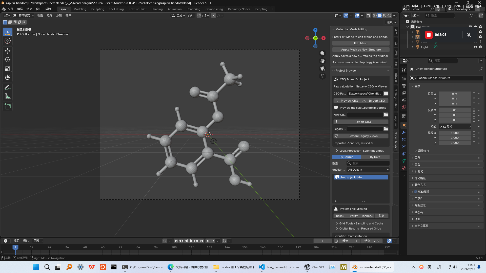
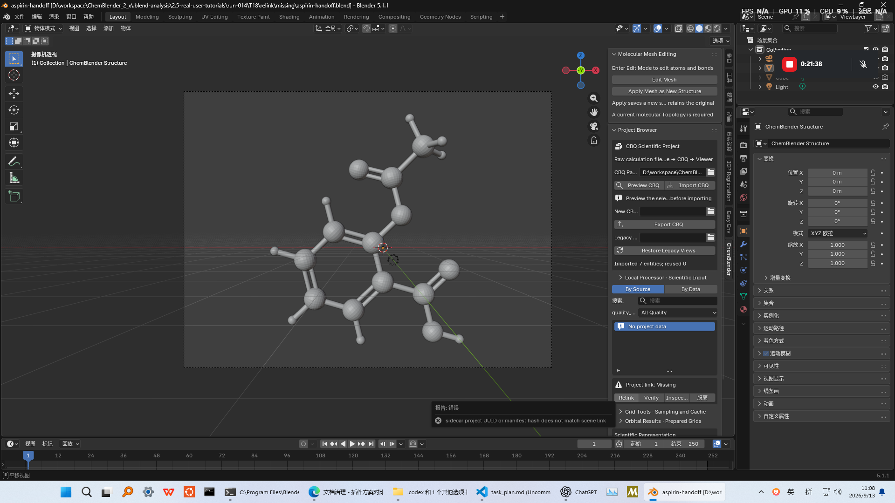
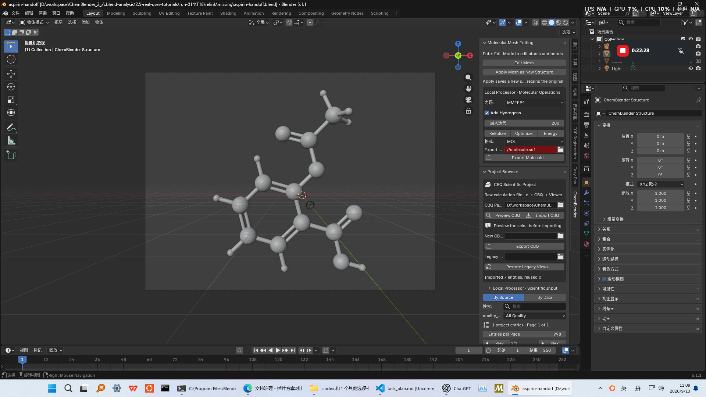
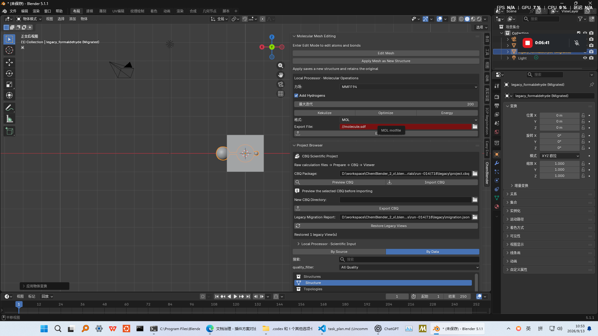

# 能力与项目生命周期

Standard processor 提供核心 CBQ 操作、22 个注册 reader（按声明依赖决定可用性）和 13 种公开导出格式。精确清单见源码生成的 [public-surface.json](../../prepare/public-surface.json) 与 [format-capabilities.json](../format-capabilities.json)。

`capabilities` 是当前机器的实时事实源。`doctor` 在 Standard NumPy/RDKit/Gemmi 不完整时失败，并对未配置的专业 route、critic2、QCEngine/provider operation 或 reader 给出具体 warning。

保存后的项目由两部分组成：

- `project.blend`：Scene、Blender View、呈现状态和 project link。
- `project.cbq/`：权威科学实体、provenance、revision、数组和可重建缓存。

两者必须一起移动。导入与外部 operation 追加带 provenance 的实体；Mesh Apply 创建 derived Structure，不改写 imported 坐标。View 的外观变化不会自动变成科学数据。

## 保存、移动与恢复工程（T18）

选择 **File > Save As**，输入新的 `.blend` 文件名，再点击 **Save As**。ChemBlender 会写入同名 `.cbq` 文件夹。移动时携带两者；退出 Blender 后重新打开移动后的 `.blend`，检查工程交接。文件对话框中的 **Cancel** 会保留当前工程。

如果只移动了 `.blend`，已有对象可能仍然可见，但科学数据不可用。在 3D Viewport 按 **N**，选择 **ChemBlender**，找到 **Project Browser**。**Project link: Missing** 与 **No project data** 表示科学数据链接需要恢复；仅能看到模型不能证明工程完整。

点击 **Relink**。在文件对话框中进入正确的 `.cbq` 文件夹，文件名保留 **manifest.json**，点击 **Recover Project Link**。选错项目会提示 `sidecar project UUID or manifest hash does not match scene link`，已有 View 保留。关闭错误提示，再点击 **Relink** 选择正确的 manifest。不要用 **Detach** 绕过不匹配提示。

选择匹配的 manifest 后，Project Browser 会重新显示项目条目及完整的 Structure、provenance 记录：

恢复后保存 `.blend`，生成位于其旁边的配对 `.cbq`。退出后用新 Blender 进程重新打开，检查预期实体和 View。通过前保留原始配对工程。

T18 阿司匹林实测已核对 21 个原子、未变的实体 UUID/revision、9 份一致的科学数组、GUI Save As/Cancel、错误重链接拒绝后正确恢复，以及两份已保存工程的独立进程冷重开。上面的截图与聚焦 Blender 录屏绑定最终候选 ZIP `73fe2c24…`；旧 Save As 截图仍保留候选 ZIP `a1e2da79…` 的真实身份。这些是 Agent GUI 记录，独立人工验收仍待完成。完整记录：[当前 GUI legacy/relink](../../../examples/tutorials/2.5.0/T18-run014-direct-gui-check.json)、[历史 GUI 另存](../../../examples/tutorials/2.5.0/T18-run007-gui-save-check.json)、[历史 GUI 恢复](../../../examples/tutorials/2.5.0/T18-run007-gui-relink-check.json)、[冷重开](../../../examples/tutorials/2.5.0/T18-run007-gui-pairs-cold-check.json)。

在 T06、T07 的隔离副本中，Phase 4 测试候选 `2637ce7c…` 还在记录源文件被移走、processor 首选项指向不存在的可执行文件时，完成了派生几何/VDB 缓存重建和冷重开；权威数组与原工程均未改变。缺失、损坏、不同工程和过期副本会先被拒绝，再允许正确重链接。

处理 2.1 legacy 文件时，先运行外部 legacy exporter；然后在 **CBQ Scientific Project** 选择导出的 `project.cbq`，依次点击 **Preview CBQ**、**Import CBQ**，把 `migration.json` 选为 **Legacy Migration Report**，再点击 **Restore Legacy Views**。最终候选恢复出 `legacy_formaldehyde (Migrated)`，并显示 `Restored 1 legacy View(s)`：

外部导出、科学一致性、原生冷重开、当前直接 GUI restore/relink 与第二 clean profile 均已通过；仍缺 conforming T18 run manifest 和独立人工复做。见[当前 T18 审计](../../../examples/tutorials/2.5.0/T18-current-candidate-check.json)。
