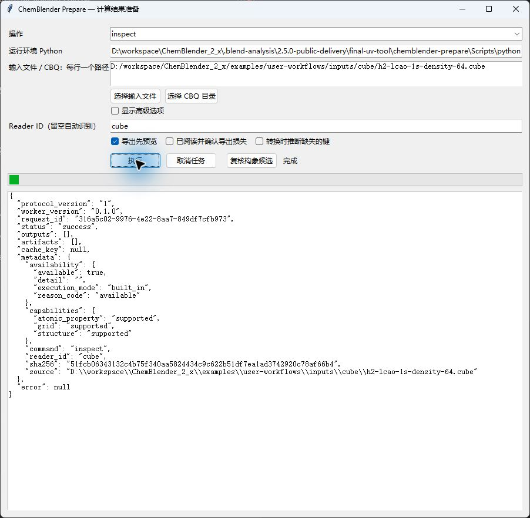
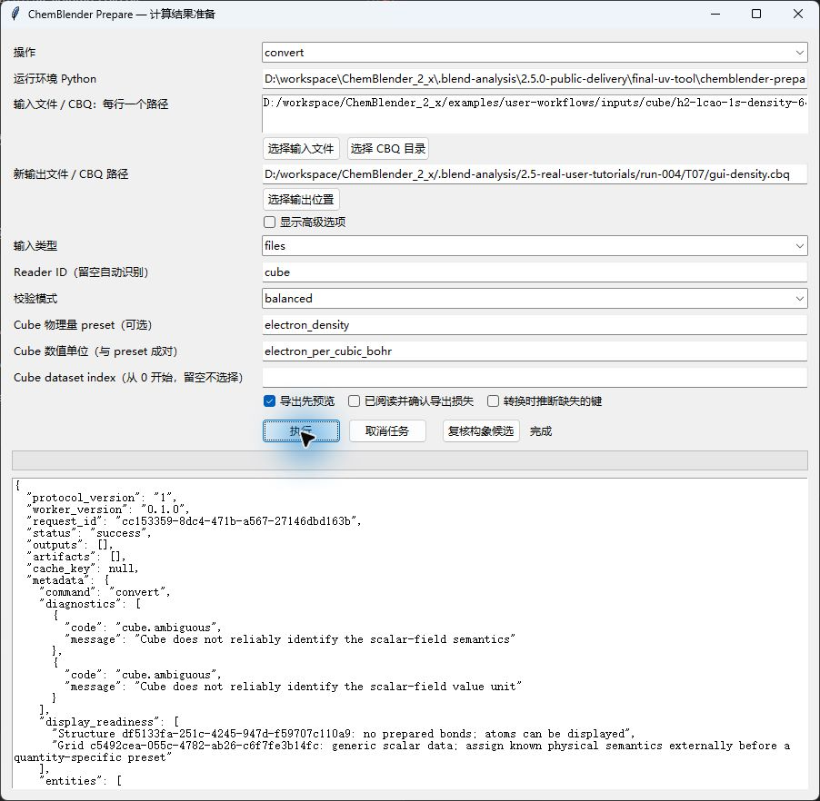
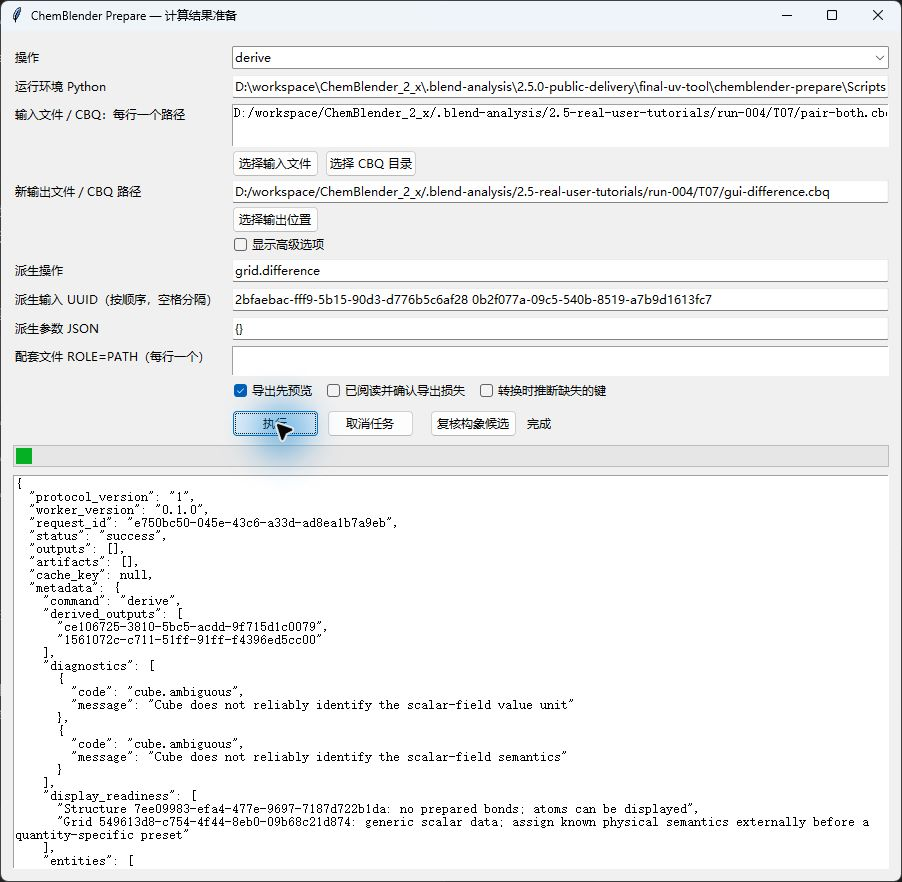
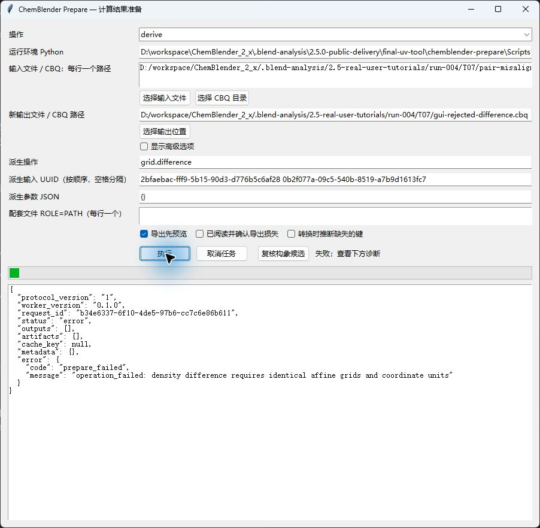
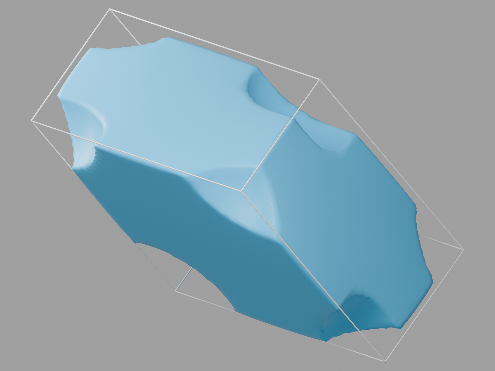

# T07：密度网格、切片与正负等值面

执行草稿。公开转换、五种主网格 View 的实际 GUI 创建、正负显示、数值采样、渲染及串行冷重开/缓存恢复已有证据。VASP GUI、其余配图及人工独立复做仍待完成。


这是解析教学模型的密度差，不是分子轨道或 HF/DFT 计算。细化后轮廓更密，但仍有插值条带。照明会改变视觉颜色，此图不能作为定量色标。

## 固定输入

先完成[安装](installation.md)和[首课](first-aspirin.md)。使用 Blender 5.1.1、prepare 0.1.0；候选 Extension SHA-256 为 `963b905f3e5ee3c5fc1fa53a1ccefd5c60616d89ac77977efe4afdbed066426a`。

下载 [h2-lcao-1s-density-64.cube](../../../examples/user-workflows/inputs/cube/h2-lcao-1s-density-64.cube)、[来源与许可说明](../../../examples/user-workflows/inputs/cube/h2-lcao-1s-density-64.md)及[冻结规格](../../../examples/tutorials/2.5.0/T07.case-spec.json)。来源说明中的旧导入流程不能代替以下 CBQ 路线。

| 项目 | 参考值 |
| --- | --- |
| SHA-256 | `51fcb06343132c4b75f340aa5824434c9c622b51df7ea1ad3742920c78af66b4` |
| 模型 | 仓库解析 H2 成键 1s LCAO 密度；GPL-3.0 |
| 形状 | 64 × 64 × 64，共 262144 个样本 |
| 坐标 | bohr；原点 (-6,-6,-6)，对角步长 0.1904761905 |
| 原子 | H 位于 z = -0.7 和 +0.7 bohr |
| 数值 | electron_per_cubic_bohr；最小 7.75746861e-10，最大 0.229296377 |
| 矩形求和积分 | 按文件步长为 1.9996717595939106，约 2 个电子 |

Cube 核电荷列中的零是占位值，不应解释为真实核电荷。

## 准备与导入

在 Prepare 保持已安装的 Standard 运行环境 Python。选择 `inspect`，输入主 Cube 路径，Reader ID 设为 `cube`，点击 `执行`。预期返回 `success`、Reader 可用状态和固定输入哈希。



从操作列表选择 `convert`。切换操作会重排表单，需要重新定位字段。保留输入类型 `files`、Reader ID `cube`、校验模式 `balanced`。设置新输出路径，Cube preset 为 `electron_density`，Cube 数值单位为 `electron_per_cubic_bohr`。此输入只有一个数据集，dataset index 留空。点击 `执行`，预期成功。记录中的新输出为 `gui-density.cbq`，原工程保留。



[GUI 输出独立检查](../assets/2.5-tutorials/grid-gui-density-check.json)确认全部 262144 个值及仿射步长完全一致，同时保留原始 ambiguous 和追加 complete 网格。以下为等价公开命令，请替换路径并使用新输出。


```powershell
chemblender-prepare inspect "D:\ChemBlenderLessons\T07\h2-lcao-1s-density-64.cube" --reader cube --json
chemblender-prepare convert "D:\ChemBlenderLessons\T07\h2-lcao-1s-density-64.cube" --reader cube --preset electron_density --unit electron_per_cubic_bohr -o "D:\ChemBlenderLessons\T07\h2-density.cbq" --json
chemblender-prepare validate "D:\ChemBlenderLessons\T07\h2-density.cbq" --json
```

预期成功，保留原始 ambiguous 的 `scalar_field` / `unknown` 网格，并追加 complete 的 `electron_density` 网格。显式语义来自固定输入的来源说明；Cube 本身不能可靠确定物理量。[独立检查](../assets/2.5-tutorials/grid-science-check.json)核对全部标量、原点和步长，误差为零。

1. 在 Blender 的 ChemBlender 侧栏设置 `CBQ Package`，依次使用 `Preview CBQ`、`Import CBQ`。本次通过 MCP 重放已验证操作。如果浏览器尚未绘制，先打开 ChemBlender 标签，不要重复导入。
2. 在 Project Browser 选择 complete 的 Electron Density。在 `Scientific Representation` 核对 `Coordinates: bohr` 和 `Values: electron_per_cubic_bohr`。
3. `Automatic` 对应 Grid volume 时点击 `Create View`。记录中的 Density Scale 为 10；它改变显示，不修改科学密度。
4. 选择 `Signed scalar isosurface`，保留 `Dataset Index` 0，将 `Isovalue` 设为 0.05，点击 `Create View`。在视口和渲染中隐藏先前体积，单独查看曲面。


主密度全部为正，正曲面有 882 个顶点、880 个面，负曲面为空。这符合输入，不是正负渲染失败。

## 采样切片、剖面与色标

每次 Create 前选择完整主密度。以下三种创建均经过实际 GUI 操作。保留独立 View，检查时隐藏重叠的其他 View。

| Representation | 设置 | 预期检查 |
| --- | --- | --- |
| Scientific plane slice | 原点 (-1,-1,0)，U (2,0,0)，V (0,2,0)，65 × 65；关闭对称范围，颜色范围 0 至 0.25 | 4225 个有效样本，相对独立三线性插值最大误差 7.404e-9 |
| Scientific line profile | 起点 (-1,0,0)，终点 (1,0,0)，129 样本 | 距离标签 0–2 bohr；数值 0.0630902003 至 0.176022212，最大误差 7.951e-9 |
| Scientific colorbar | 关闭对称范围，颜色范围 0 至 0.25；宽 2、高 0.2，显示单位 angstrom | 端点 0、0.25，标签 electron_per_cubic_bohr |

每种设置完成后点击 `Create View`。上述切片/剖面坐标单位为 bohr。增加显示样本是在同一 64³ 场上插值，不会增加科学信息。参见[切片检查](../assets/2.5-tutorials/grid-slice-check.json)和[剖面/色标检查](../assets/2.5-tutorials/grid-profile-check.json)。


图中保留原生剖面极值和距离标签。短平台来自固定科学网格的插值，没有通过平滑曲线掩盖。左侧为 XY 切片，右侧为线剖面，下方色条对应密度值；英文说明强调显示采样不增加科学分辨率。

在新保存的工程对中排版，保持采样数组不变：将切片根对象移到 (-0.75,0.25,0)，剖面根对象移到 (0.85,0.78,0)，色标根对象移到 (-1.279,-0.59,0)；色标统一缩放 0.52917721，端点标签仍为 0 和 0.25。仅在渲染中隐藏剖面的物理 Path 对象，保留 Graph、Axes 和标签。图线 bevel depth 设为 0.003，坐标轴为 0.0015，剖面标签字号为 0.04。这些是排版位置和显示线宽，不替代上表的源坐标。

正交相机位置 (0,0,8)，旋转 (0,0,0)，scale 3.4；白色 World；Standard 视图变换、exposure 0、gamma 1。使用 Cycles CPU、2400 × 1800、256 samples 和降噪。额外标题注明来源和采样边界。排版使用已知原生场景操作；GUI 创建证据来自之前的截图，不能用此渲染图代替。[渲染与冷重开记录](../assets/2.5-tutorials/grid-sampling-render.json)。Rebuild 后可能需要重新应用自定义排版和线宽。


## 从固定输入重算

将 [recompute_t07_difference.py](../../../examples/tutorials/2.5.0/recompute_t07_difference.py)、[generate_t07_density_pair.py](../../../examples/tutorials/2.5.0/generate_t07_density_pair.py) 和主 Cube 下载到同一教程目录。使用现有 Python 3 解释器，这两个脚本只需要标准库。`--prepare` 指向已安装的处理器可执行文件，不是 Blender。替换以下路径，且 `recomputed` 目录必须尚不存在。

```powershell
python "D:\ChemBlenderLessons\T07\recompute_t07_difference.py" --prepare "D:\Tools\chemblender-prepare.exe" --source "D:\ChemBlenderLessons\T07\h2-lcao-1s-density-64.cube" --output "D:\ChemBlenderLessons\T07\recomputed"
```

脚本核对源文件 SHA-256，然后依次执行以下公开操作：

1. 生成双数据集教学 Cube，预期 SHA-256 为 `8902b35f01edee818cd794793c152c7bfc766b8d0d08cb794077c9e0deef3b7c`。
2. `convert --reader cube --preset electron_density --unit electron_per_cubic_bohr --dataset-index 0` 创建 `pair-first.cbq`，保留原始 ambiguous 双数据集网格，并追加 complete 成键密度。
3. `derive --operation grid.resolve_semantics` 接收该 ambiguous 网格 UUID，使用参数 `{"dataset_index":1,"preset_id":"electron_density","value_unit":"electron_per_cubic_bohr"}` 创建 `pair-both.cbq`。两份密度共享同一个 Structure。索引从零开始，使用 0/1；Cube 源 ID 1/2 不是 CLI 索引。
4. `derive --operation grid.difference --input LEFT --input RIGHT` 写出 `pair-difference.cbq`。LEFT 为成键密度，RIGHT 为孤立原子密度；脚本从本次 WorkerResult 读取 UUID，不硬编码旧运行的编号。
5. `validate` 必须成功。将最终 CBQ 导入 Blender，选择 `Difference` / `difference_density` 数据集，再按下节设置正负等值面。

每步保存实际 CLI 参数列表 `*.argv.json`、原始 WorkerResult `*.stdout.json` 和 stderr。命令失败时脚本停止；检查这些文件，修正原因后使用新的输出目录。不要交换相减顺序。[重放检查](../assets/2.5-tutorials/grid-recompute-check.json)验证了全部 262144 个值、独立下载脚本运行以及拒绝覆盖已有结果。这是公开 CLI 重算路线，下节已验证差分 GUI。

## 在 Prepare GUI 中执行差分

使用上述重算路线生成的 `pair-both.cbq`，其中必须已有两份 complete 密度。在 Prepare 选择 `derive`，将此 CBQ 设为输入，设置新的输出路径。派生操作填写 `grid.difference`。输入 UUID 一栏先填成键密度 UUID，再填孤立原子密度 UUID，中间以空格分隔；参数保留 `{}`。从自己的 convert/resolve 结果读取 UUID，不要照抄截图编号。点击 `执行`。



GUI 输出 `gui-difference.cbq` 的全部 262144 个值均通过独立比较。在 Blender 选择派生的 `difference_density` 后，使用下节相同的正负显示设置。这里验证了差分 GUI；双数据集的语义赋值仍按 CLI 路线操作。



拒绝测试使用明确准备的一次性副本，仅将右侧原点平移 0.1 bohr。Prepare 提示 `density difference requires identical affine grids and coordinate units`，没有生成输出，两份输入包字节均未改变。实际数据遇到此错误时，检查结构身份、原点、步长、形状和单位，不要改标签或强行相减；保留原工程并修正上游输入。参见[GUI 差分及拒绝检查](../assets/2.5-tutorials/grid-gui-difference-check.json)。

## 正负差分结果与细化

记录中的扩展示例在同一 Structure 和仿射网格上，用成键密度减去两个孤立解析 1s 原子密度之和。[可复现输入生成器](../../../examples/tutorials/2.5.0/generate_t07_density_pair.py)和冻结规格定义了两个数据集。公开 `grid.resolve_semantics` 与 `grid.difference` 处理已通过；下述 CLI 重算步骤已通过，上节已验证差分 GUI。

对记录中的差分数据集，选择 `Signed scalar isosurface`，设置 Isovalue 0.005，点击 `Create View`。蓝色表示正重分布，橙色表示负重分布。[差分检查](../assets/2.5-tutorials/grid-difference-check.json)核对了全部 262144 次相减，范围为 -0.0345176831 至 0.0204030833。仅在一次性副本中将右侧网格平移 0.1 bohr 后，处理器因仿射几何不兼容而拒绝，输入不变且没有输出。


实际 `Separate Positive / Negative Volume` 控件也已测试：使用一个有符号 VDB 和两个着色分支，不是两个独立科学网格。全部 VDB 数值与科学差分在 float32 精度下误差不超过 1.122e-9；


复现此图：选择差分网格，选择 Grid volume，勾选 `Separate Positive / Negative Volume`，将 `Volume Density Scale` 设为 100。已有体积 View 时，使用 `Load Selected View`，修改强度后点击 `Update Selected View`。在视口和渲染中隐藏正负曲面及其他 View。记录中的公开 LOAD/UPDATE 保持科学数组不变；着色检查确认使用 `max(100f,0)`、`max(-100f,0)`，没有额外 Density Attribute 乘算。蓝色表示正重分布，橙色表示负重分布；光学颜色不是定量密度色标。

保持相机位置 (4,-8,3) 朝向原点，将正交 scale 增至 4.8。主面光源位于 (2,-4,5)，朝向原点，3000 W、size 4；增加圆盘面光源 (-3,-2,1)，同样朝向原点，1200 W、size 3。World 颜色为 (0.015,0.015,0.015)，strength 0.7。使用 Cycles CPU、2400 × 1800、256 samples 和降噪。此场景默认 scale 10 过淡，之前的 scale 10/100 对照图均保留在本地证据中。提高光学强度不重算或修改 VDB。参见[数组/VDB 一致性及冷重开证据](../assets/2.5-tutorials/grid-volume-render.json)。人工图像审阅仍待完成。


预览图记录的设置为 Cycles CPU、2400 × 1800、256 samples、降噪；Principled 材质 Roughness 0.32；正交相机 (4,-8,3) 朝向原点、scale 3.2；面光源 (2,-4,5)、450 W、size 4；世界颜色 (0.12,0.12,0.12)、strength 0.7。在视口和渲染中隐藏无关 View。

在 Geometry Nodes 中选中各正负曲面的 `Volume to Mesh` 节点，将 `Resolution Mode` 从 `Grid` 改为 `Size`，设置 `Voxel Size` 0.025，保持 Threshold 0.005。正曲面的新控件通过 Computer Use 验证，负曲面重放相同操作。顶点数由 490/612 增至 8464/9972。Blender 原生长度标签跟随场景设置；这里数值 0.025 个显示单位对应 0.025 angstrom。源网格步长仍约 0.1007956592 angstrom。这属于显示重采样，不是更细的科学计算。

## VASP 变体：Li CHGCAR



这是已有 VASP 输出的导入，不是新执行的 VASP 计算。下载固定 [CHGCAR](../../../examples/tutorials/2.5.0/inputs/li-chgcar/CHGCAR)、[MIT 许可](../../../examples/tutorials/2.5.0/inputs/li-chgcar/LICENSE)和[变体规格](../../../examples/tutorials/2.5.0/T07-vasp.case-spec.json)。输入来自 pymatgen-core 提交 `488ad74cc5ecaba5d24c1726e2762fb47f31f5ef` 的 `CHGCAR.nospin.gz`，仅解压，没有修改数据。SHA-256 为 `b58e1fb93dedfa746c3f5d1efe033a0560938b375adddd6ff40ef932a73a3c3a`。

已验证的处理器路线复用现有 scientific Python、pymatgen-core 2026.7.16 和冻结 prepare 代码，没有安装依赖。使用 Reader ID `pymatgen-vasp-grid` 前，先核验[专业运行路线](../../prepare/zh-CN/advanced-routes.md)，不能假定 Standard 自带此后端。该路线的公开 inspect/convert/validate 已通过；VASP GUI 教程仍待补齐。

输入包含一个分数坐标为 (0,0,0) 的 Li 原子、体积 20.148362761266316 angstrom³ 的非正交晶胞和 32³ 网格。按 x 最快读取数值，除以晶胞体积；各晶格矢量除以 32 即对应网格步长。适配器记录单位 `inverse_cubic_angstrom`，应保留此原始标记。全部 32768 个归一化数值及仿射步长通过独立核对，积分为 0.9999999934509904。参见[处理、View 与冷重开检查](../../../examples/tutorials/2.5.0/T07-vasp-check.json)。

Preview/Import 生成的 CBQ，选择 complete 电子密度，创建 Grid volume 或 Signed scalar isosurface。图中等值为存储单位下的 0.04，使用 shaded 材质、Roughness 0.32、Cycles CPU、2400 × 1800 和 256 samples。12 条注释边直接由晶胞矢量生成；相机和光照只影响显示。正曲面有 6392 个顶点，负曲面为空，与全正密度一致。VDB 索引到空间坐标的检查确认非正交仿射变换保留。

此图显示有限网格域，边缘外观受采样域边界影响，不能把外形解释为真实晶体表面。此处未重建 PAW augmentation occupancies。保存的工程对冷重开后，本地 VDB 路径和科学数组保持不变；此变体的独立移动副本冷重开已通过。仅在该副本中删除五个派生 VDB，重建两个 View 后再次冷重开通过，十二条晶胞注释边和全部科学数组保留，原工程未改变。参见[变体恢复记录](../../../examples/tutorials/2.5.0/T07-vasp-recovery-check.json)。GUI 恢复、源文件/处理器不可用恢复及人工审阅仍待完成。

## 保存、交接与恢复

保存 `h2-grid.blend` 及旁边的 `h2-grid.cbq` 文件夹，移动时携带整对文件。记录中的工程包含七个 View 根对象。原工程和移动副本分别在独立进程中冷重开，本地 VDB 路径、科学哈希及曲面细化设置均保留。当前教程进程退出前不要另开 Blender。

仅在新的一次性副本中删除八个 `cache/render` VDB 文件，再对七个 View 使用 `Rebuild Selected View`：公开 Operator 重放和随后独立冷重开均通过。不要删除权威 `.npy` 数组。参见[恢复记录](../../../examples/tutorials/2.5.0/T07-recovery-check.json)。

Rebuild 会恢复生成时的 `Grid` 分辨率，需要随后重新应用 Size 0.025 及自定义材质细化。原始细化工程不变。这些检查尚不能证明 GUI 恢复，或源文件与处理器均不可用时的重建；不能据此标为完整离线可用。可分发案例包和人工独立验收仍待完成。
