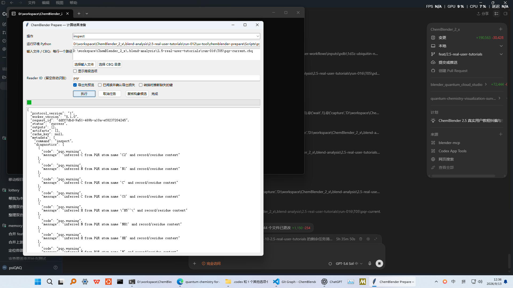
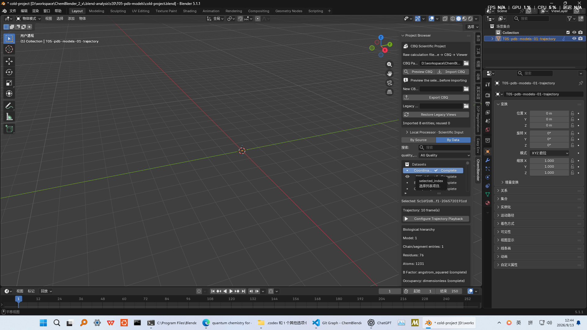
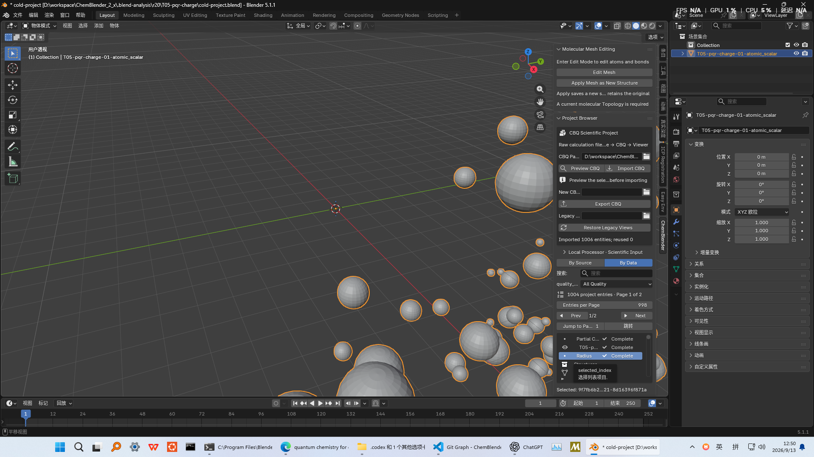
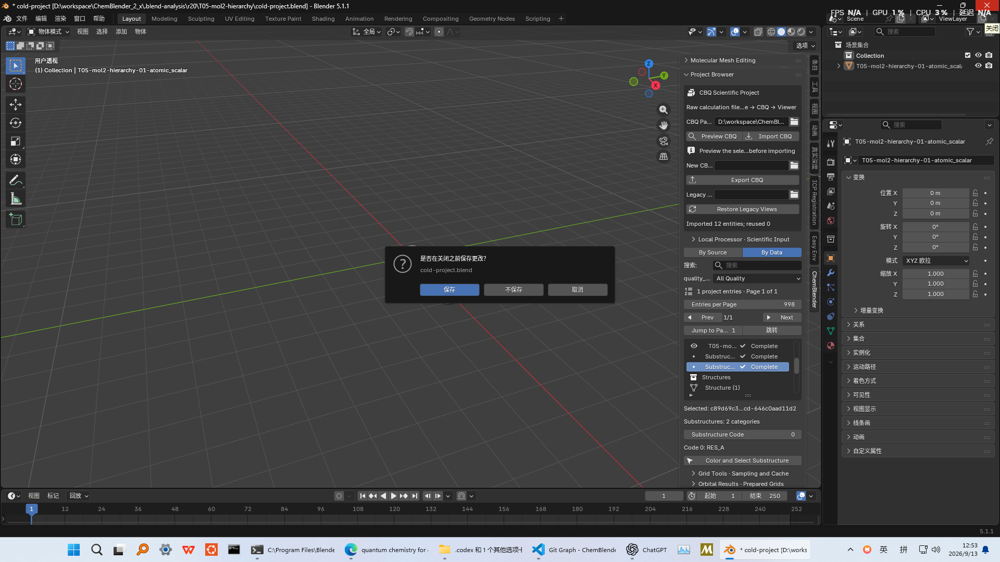
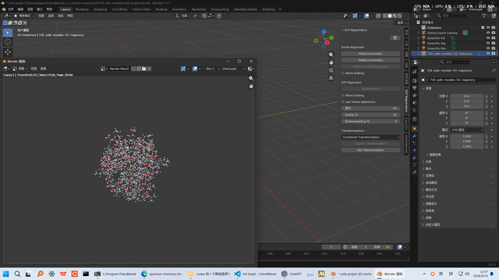

# 科学案例合集

本章覆盖当前本地候选的 T03、T05、T08–T16、T19、T20 和 B01。下载 [review package](../../offline/artifacts/scientific-viewer-review.zip)（SHA-256 `4d921d21c475c0ae11acd25cc5f76d9552643d8a98f7a791968d5b7d1827483e`）。包内有 22 个目录，每个目录都让 `project.blend` 与完整 `project.cbq/` 相邻，并附原生 PNG 渲染。导入源被刻意排除；所有工程对均在独立进程冷重开，并在无 processor 时通过 `Rebuild Selected View`。

统一的精确 Viewer 步骤：完整解压且不要改成员名，打开 `project.blend`，确认 Project Browser 显示 connected，选择实体或 View，然后在 `Scientific Representation` 中选择下表 preset、模板 `Research`，点击 `Create View`。恢复时选择 View 并点击 `Rebuild Selected View`；不得删除 `project.cbq/arrays/*.npy`。这些是 Blender 原生后台结果，不是鼠标键盘直录，也不是独立人工验收。

| 案例 | 固定输入与准确路线 | 可见结果与科学边界 | 证据 |
| --- | --- | --- | --- |
| T03 | Prepare GUI `Convert`：`mixed-properties.sdf`、reader `sdf`；检查全部三条 SDF record，复核建议的原子映射；再使用窗口填回的有序 record UUID、`suggestion_id`、`snapshot` 和 `review_confirmed=true` 执行 `molecule.group_conformers`。把结果 ConformerSet 导出为 SDF 并重新导入。Viewer 中每个 Structure 使用 `Structure publication`。 | 三条源记录保持独立；显式确认新增一个 identity mapping 的 ambiguous 三帧 ConformerSet。流程不使用 `molecule.conformers` 或 `count=3`。`ccd-3d-showcase.sdf` 必须得到零个 suggestion。SMILES/MMFF94 归 T02，不归 T03。 | [回执](../../../examples/tutorials/2.5.0/T03-current-candidate-check.json) |
| T05 | 固定 PDB/PQR/MOL2；Prepare GUI `convert`；PDB 用 `Trajectory frame`，PQR/MOL2 charge 用 `Atomic scalar`。 | PDB model 顺序、PQR charge/radius、MOL2 hierarchy 分开保留；同为 atom-indexed 不代表同义。 | [回执](../../../examples/tutorials/2.5.0/T05-current-candidate-check.json) |
| T08 | 固定 FCHK/Molden，经 `python.wavefunction`；记录的 `33³`、`0.25 bohr` HOMO/LUMO grid；`Signed scalar isosurface`，`+0.03/-0.03`。 | 正负相位均可见。有限盒归一化不是全空间证明。 | [回执](../../../examples/tutorials/2.5.0/T08-current-candidate-check.json) |
| T09 | 固定 water、CH3 和单原子 nitrogen FCHK；选择 CH3 spin density 与 `Signed scalar isosurface`。 | `nitrogen-mp2.fchk` 只有一个 N 原子，不是 N2。自旋密度保留正负；total、spin、post-SCF-minus-SCF 是不同数据集。 | [回执](../../../examples/tutorials/2.5.0/T09-current-candidate-check.json) |
| T10 | 固定 water density/ESP，必须同 Structure、同 affine grid；`Property on surface`。 | ESP 给 density 等值面着色，ESP 不是等值阈值；核奇点探针会被拒绝。 | [回执](../../../examples/tutorials/2.5.0/T10-current-candidate-check.json) |
| T11 | 固定 Gaussian/ORCA，经 `python.scientific`；`Vibration mode`、selection index `1`、`Apply Phase`；光谱另用 `Spectrum plot`。 | IR/Raman 字段不混用；phase 是动画相位，不是物理时间。 | [回执](../../../examples/tutorials/2.5.0/T11-current-candidate-check.json) |
| T12 | 固定 Gaussian/ORCA TD；UV–Vis/ECD 用 `Spectrum plot`；只有完整 Gaussian state 用 `Electronic spectrum linked`。 | Gaussian ECD 保留 length gauge/unit；ORCA 缺失项保持 unknown，使用 spectrum-only View。 | [回执](../../../examples/tutorials/2.5.0/T12-current-candidate-check.json) |
| T13 | 固定 silicon band + KPOINTS 与独立 DOS，经 `python.scientific`；`Band structure`/`Density of states`；reference `absolute`。 | 保留声明的 k path；不同 Structure/Fermi level 不静默对齐合并。 | [回执](../../../examples/tutorials/2.5.0/T13-current-candidate-check.json) |
| T14 | 固定 NaCl phonopy 六文件；`Phonon mode`、q-point index `1`、mode index `0`，再预览 phase。 | 展示周期复模式相位，不是时间。 | [回执](../../../examples/tutorials/2.5.0/T14-current-candidate-check.json) |
| T15 | 固定 critic2 JSON/NCI；`Topology graph` 与 `NCI surface`。 | 展示 5 个 critical point、4 条有序 path 与配对 40³ field；不虚构路径或键能。 | [回执](../../../examples/tutorials/2.5.0/T15-current-candidate-check.json) |
| T16 | MIT 声明的 SrVO3 六个文本文件，经 `python.fermi`；`Fermi surface`。 | 声明的 21³ Gamma mesh 上 bands 16–18；排除 POTCAR/WAVECAR/CHG/HDF5/pickle。 | [回执](../../../examples/tutorials/2.5.0/T16-current-candidate-check.json) |
| T19 | 显式 external Python register/discover/conformance；Viewer `Structure publication`。 | Reader API 可用，但不加入普通 GUI 的 22 个 reader。 | [回执](../../../examples/tutorials/2.5.0/T19-current-candidate-check.json) |
| T20 | 通过 `python.qcschema` 执行 `qcschema.compute@1`；选择 gradient 与 `Atomic vector`。 | 实际 PySCF 2.13.1 RHF/cc-pVDZ 能量 `-76.0214183672713 Eh`；交换成功不等于计算成功。 | [回执](../../../examples/tutorials/2.5.0/T20-current-candidate-check.json) |
| B01 | 无 provider credential/live transport 时，Prepare GUI 先 `capabilities` 后 `doctor`，并测试 Cancel。 | provider unavailable，无网络请求、无输出；负向边界按设计无科学 render/project。 | [回执](../../../examples/tutorials/2.5.0/B01-current-candidate-check.json) |

## T03 直接 GUI 步骤

1. 在 Prepare `Convert` 中选择 `examples/user-workflows/inputs/sdf/mixed-properties.sdf`，reader 设为 `sdf`，指定输出 `.cbq` 后点击 `Run`。
2. 切换到 `Inspect`，选择刚生成的 CBQ 并点击 `Run`。确认 `record_count: 3` 和 `conformer_suggestion_count: 1`；打开 `Review Conformer candidate`，核对有序的三条 record、每条 record 的 mapping `[0, 1, 2]`，以及 symmetric-isomorphism 警告。
3. 勾选“已阅读并确认”，点击“填入派生任务”。回到主窗口后保留派生操作 `molecule.group_conformers`、按显示顺序填入的三个 input UUID，以及参数 `suggestion_id`、`snapshot`、`review_confirmed: true`；选择新的输出 CBQ 后点击“执行”。不要填写 `molecule.conformers` 或 `count=3`。结果必须包含 shape `[3, 3, 3]`、unit `angstrom`、status `ambiguous` 的 `ConformerSet`，同时三条源 Structure 仍保留。
4. 在 `Export` 中选择该 ConformerSet 与 `sdf`，先 Preview，再 Write。把写出的 SDF 转回 CBQ，并对两份 CBQ 执行 `validate`。
5. 转换 `ccd-3d-showcase.sdf`，检查后点击 `Review Conformer candidate`。界面必须显示 `conformer_suggestion_count: 0` 并拒绝 review。
6. 保持 `project.blend` 与 `project.cbq/` 相邻，在 Blender 打开工程，确认 Project Browser 有三条记录，选择第一条 Structure 后按 F12。恢复时让导入源不可用，冷启动打开工程对，逐个选择 View，在无 processor 条件下点击 `Rebuild Selected View`。

最终 F12 使用原生渲染回执中已经记录的相机矩阵。恢复该矩阵和 render visibility 是获授权的 MCP 辅助，不标成直接 GUI 点击；打开最终安装候选、检查 Project Browser、按 F12、检查结果以及不保存退出属于直接 OS GUI。技术检查已通过，独立人工验收仍未签署。

## T05 直接 GUI 步骤

1. 在 Prepare `Convert` 中分别转换 `examples/user-workflows/inputs/pdb/1d3z-ubiquitin-nmr.pdb` 与 `pdb/multimodel.pdb`，reader 为 `pdb`；再用 `Inspect` 打开两份 CBQ。前者必须显示 `10 × 1231 × 3` 的 FrameSet，后者必须保留 model identity warning 并生成独立 Structure，不能伪造 trajectory。
2. 转换并检查 `pqr/apbs-protein-rna-nb.pqr`，reader 为 `pqr`。结果必须保留 998 个 charge/radius、41 个 residue、两个推断 segment；零 radius 仍是原始值，不自动替换。
3. 转换并检查 `mol2/substructure.mol2` 与 `mol2/openbabel-5sun-protein.mol2`，reader 为 `mol2`。小文件必须有 3 atoms、2 bonds、2 substructures；大文件保留 DICT/NORMAL/SET 等声明与 `un` bond warning，但不把 6248 条未知 bond 解释成 topology。
4. 打开 PDB 的相邻 `project.blend + project.cbq/`，在 Project Browser 切到 `By Data`，选择 Coordinates FrameSet，确认 `Trajectory: 10 frame(s)`、Model 1、1 个 chain/segment、76 residues、1231 atoms；点击 `Configure Trajectory Playback`，时间轴终点应变为 10。
5. 顺序打开 PQR 与 MOL2 工程对。PQR 的 `Partial charge` 和 `Radius` 均须为 `Complete` 且可选；MOL2 须显示两个 Substructure category、`RES A` 选择控件，以及 `Explicit File · Complete · 2 bonds` topology。三次 Blender 会话必须逐个关闭并选择“不保存”。
6. PDB 工程按 F12 检查完整结构；三个原生 render 分别覆盖 trajectory、PQR charge 和 MOL2 partial charge。恢复测试让导入源与 processor 均不可用，再在独立冷进程选择 View 并执行 `Rebuild Selected View`；必须保持科学数组哈希不变。

最终 PDB F12 只在内存中恢复原生回执已记录的相机与灯光；该 MCP 辅助不标成直接 GUI。run-016 的技术检查已通过，review ZIP 内只有相对路径；独立人工验收仍未签署。

## 原生渲染图库

linked spectrum 的标签小于专用 plot render。T03、T05 已补当前 Prepare/Blender 直接 GUI；其余案例仍需逐项补直接 GUI。所有案例的独立人工验收仍未签署。
